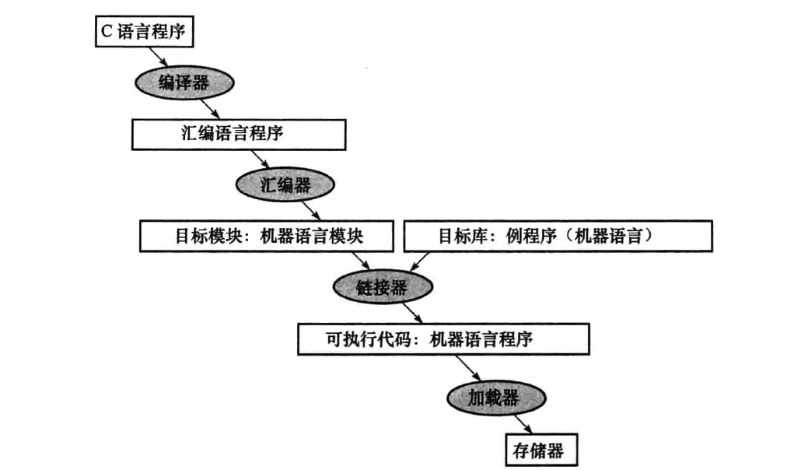
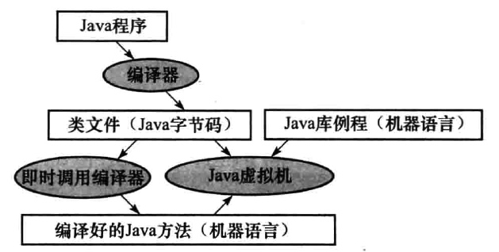

# 翻译层次

## C语言程序

### 编译器
将C程序转换成一种机器能理解的符号形式的汇编语言程序。

#### 汇编语言
一种符号语言，能被翻译成二进制的机器语言。

### 汇编器
将汇编语言程序（包含伪指令）转换成目标文件，它包括机器语言指令，数据和指令正确放入内存所需要的信息。

#### 伪指令
汇编语言指令的一个变种，通常被看做一条汇编指令。

#### 符号表
一个用来匹配标记名和指令所在内存字的地址的列表。

#### 目标文件
- 目标文件头：描述目标文件其他部分的大小和位置。
- 代码段：包含机器语言。
- 静态数据段：包含在程序生命周期内分配的数据。
- 重定位信息：标记了一些在程序加载进内存时依赖于绝对地址的指令与数据。
- 符号表：包含未定义的剩余标记，如外部引用。
- 调试信息：包含一份说明目标模块如何编译放入建明描述。

### 链接器
它是一个系统程序，把各个独立汇编的机器语言程序组合起来并且解决所有未定义的标记，最后生成可执行文件

#### 工作步骤
1. 将代码和数据模块象征性的放入内存
2. 决定数据和指令标签的地址
3. 修补内部和外部引用

#### 可执行文件
一个具有目标文件格式的功能程序，不包含未解决的引用，它可以包含符号表和调试信息

### 加载器
把目标程序装载到内存中以准备运行的系统程序

#### 工作步骤
1. 读取可执行文件头来确定代码段和数据段的大小
2. 为正文和数据创建一个足够大的地址空间
3. 将可执行文件中的指令和数据复制到内存中
4. 把主程序的参数复制道栈顶
5. 初始化机器寄存器，将栈指针指向第一个空位置
6. 跳转到启动例程，它将参数复制到参数寄存器，并且调用程序的main函数，当main函数返回时，启动例程通过系统调用exit终止程序

### 动态链接库
在程序执行过程中才被链接的库例程

## JAVA程序

