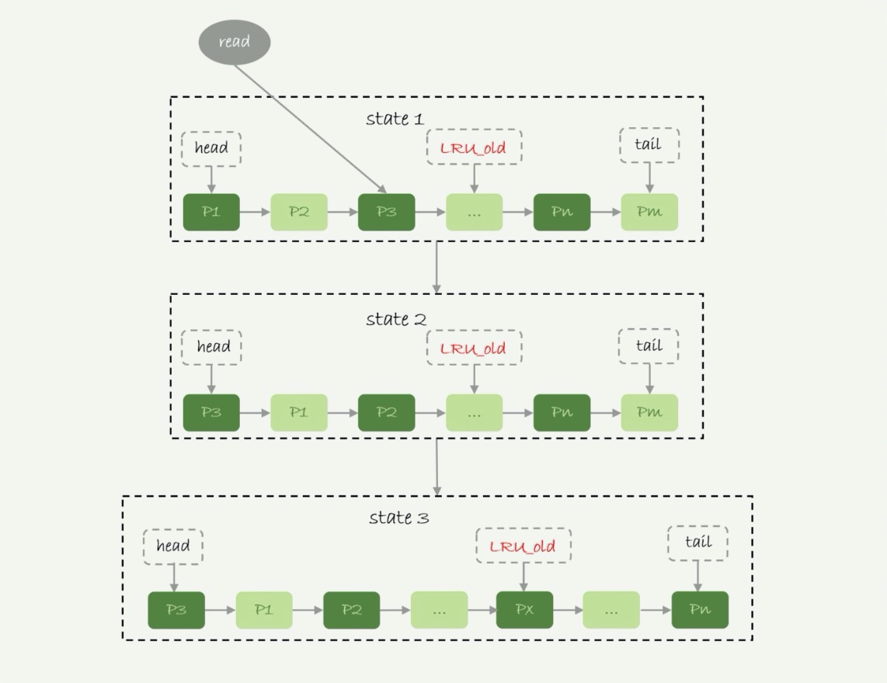
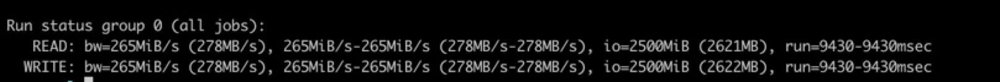

# buffer pool

## 作用
innodb的内存管理，缓存数据页。主要用于加速数据库查询和修改。
- 查询加速

  ```
  初次查询会先将数据页由磁盘载入内存，然后返回给server层。
  再次查询直接从内存中读取数据，省去磁盘IO。
  ```
  - 加速效果依赖一个重要的指标：内存命中率。
- 修改加速

  ```
  数据修改时，如数据在内存中存在，直接修改内存数据返回成功结果。
  若数据不存在，只记录change buffer，返回成功结果。
  除特殊情况外，不会有磁盘IO
  ```
  
## 容量
- 由参数 innodb_buffer_pool_size 控制
- 一般建议设置为物理内存的60%~80%

## 内存管理
LRU算法：最近最少使用算法【Least Recently Used】来管理内存。
 
1. 按5:3的比例将LRU链表分为young区域和old区域。
2. 访问数据，判断数据页是否已载入内存。
    - 未载入：将数据页从磁盘取出，放在链表old区域的开头。
    - 已载入：判断数据页在链表的什么区域。
        - young区域：将数据页提到链表的开头。
        - old区域：判断数据页在链表中是否超过X秒。【X由参数innodb_old_blocks_time控制，默认为1000毫秒】
            - 超过：将数据页提到链表的开头。
            - 不超过：保持数据页位置不变。
3. 链表尾部的数据会被淘汰。

## 刷脏页【内存数据落盘】

### 时机
1. redo log（重做日志）写满时。
2. Buffer Pool内存写满，如果淘汰的数据页是脏页，会写入磁盘。
3. 数据库空闲时。
4. 正常关闭mysql服务器时。

### 能力
- innodb_io_capacity：磁盘能力，建议设置成磁盘的IOPS
  测试工具：fio
  命令：
  
  ```
  fio -filename=test -direct=1 -iodepth 1 -thread -rw=randrw -ioengine=psync -bs=16k -size=500M -numjobs=10 -runtime=10 -group_reporting -name=mytest
  ```
  输出：
 


### 刷盘速度
刷盘速度与脏页比例和「redo log」的写盘速度有关
- 脏页比例
    - 脏页比例上限：由参数innodb_max_dirty_pages_pct控制，默认是75%。
    - 实时脏页比例：Innodb_buffer_pool_pages_dirty/Innodb_buffer_pool_pages_total
      命令（8.0版本以下）：
    
      ```
      select VARIABLE_VALUE into @a from information_schema.global_status where VARIABLE_NAME = 'Innodb_buffer_pool_pages_dirty';select VARIABLE_VALUE into @b from information_schema.global_status where VARIABLE_NAME = 'Innodb_buffer_pool_pages_total';select @a/@b;
      ```
- redo log 写盘速度

### 连坐机制
如果当前数据页旁边的数据页刚好是脏页，连带一起刷，连带动作蔓延。
- 由参数「innodb_flush_neighbors」控制：
    - 0：只刷自己
    - 1：邻居连坐

## 其他
- 内存命中率的查看方法

  ```
  执行 show engine innodb status;
  查看 Buffer pool hit rate
  ```