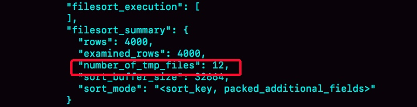
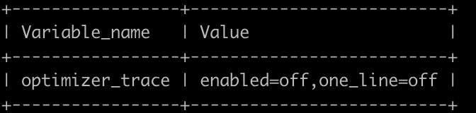

# sort buffer 有序数组

## 作用
用于辅助排序

## 容量
每线程一个
总容量受参数sort_buffer_size控制。
单行容量受参数max_length_for_sort_data控制

## 排序策略
1. 排序的总数据量 VS sort_buffer_size
    - 小于
    
      ```
      将需要的字段取出放入sort_buffer；
      将数据按照要排序的字段做快速排序。
      ```
    - 大于

      ```
      将数据按照sort_buffer_size的大小进行分份；
      对每一份进行快速排序后存入临时文件；
      对多个临时文件使用归并排序算法进行排序
      ```
2. 单行数据量 VS max_length_for_sort_data
    - 小于
    
      ```
      全字段排序
      将需要的字段取出放入sort_buffer；
      将数据按照要排序的字段做快速排序。
      ```
      
    - 大于

      ```
      rowid排序
      将主键值和要排序的字段取出放入内存。
      将数据按照要排序的字段做快速排序。
      遍历排序结果，去主键索引依次取出返回给客户端。
      ```

### 判断是否是用临时文件的方法
命令：

```
1. 会话级别临时开启：set session optimizer_trace="enabled=on",end_markers_in_json=on;
2. 执行你的SQL
3. 查询information_schema.optimizer_trace表
4. 查看 number_of_tmp_files 字段是否为0
```
结果：

   
### 判断排序算法
   
命令：

```
1. 查询optimizer_trace的步骤同上。
2. 查看sort_mode字段, 若为 <sort_key, rowid>，则为row_id排序，否则为全字段排序。
```   
   
   
## 其他

### 归并排序算法
MySQL 将需要排序的数据分成 12 份，每一份单独排序后存在这些临时文件中。然后把这 12 个有序文件再合并成一个有序的大文件。

### 查看optimizer_trace的开启情况
命令：

```
show variables like 'optimizer_trace';
```
结果：

