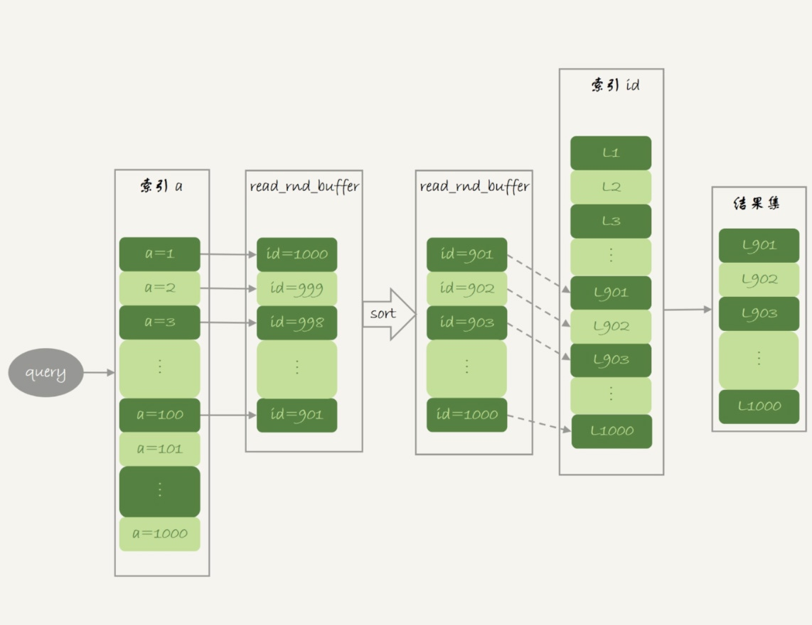

# read rnd buffer

## 作用
尽量使用顺序读盘。

## 容量
每线程1个
由参数read_rnd_buffer_size控制。

## 使用场景

- 使用普通索引&&MRR优化时

```
1. 定位到满足条件的记录，将 id 值放入read_rnd_buffer中;
2. 将 read_rnd_buffer 中的 id 进行递增排序；
3. 排序后的 id 数组，依次到主键 id 索引中查记录，并作为结果返回。
4. 如果步骤1中，read_rnd_buffer提前放满，会先执行完步骤 2 和 3，清空read_rnd_buffer，循环执行步骤1、2、3。
```

## 其他

### MRR优化
全称：Multi-Range Read。
核心在于多值查询，这个优化的主要目的是尽量使用顺序读盘。



#### 使用MRR优化的方式
想要稳定地使用 MRR 优化的话，需要设置set optimizer_switch="mrr_cost_based=off"。
【官方文档的说法，是现在的优化器策略，判断消耗的时候，会更倾向于不使用 MRR，把 mrr_cost_based 设置为 off，就是固定使用 MRR 了。】
