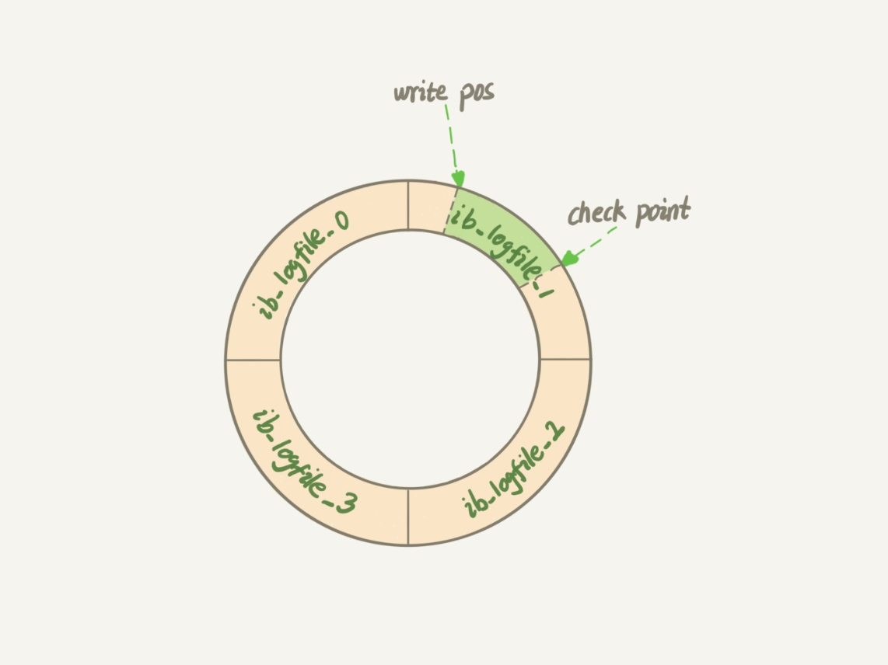
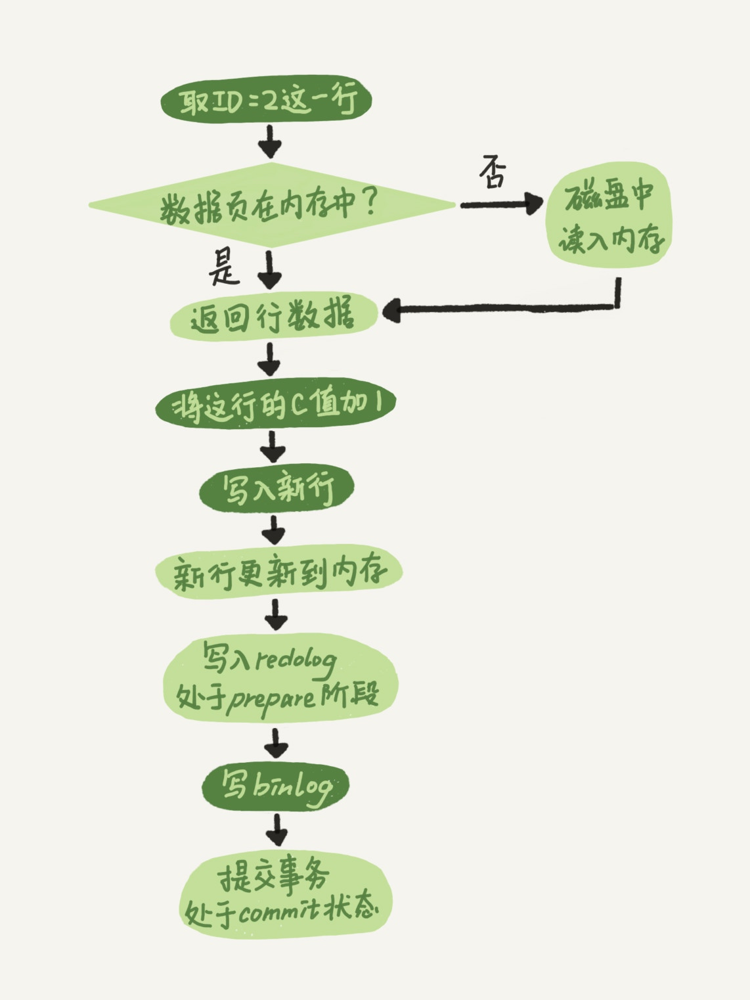
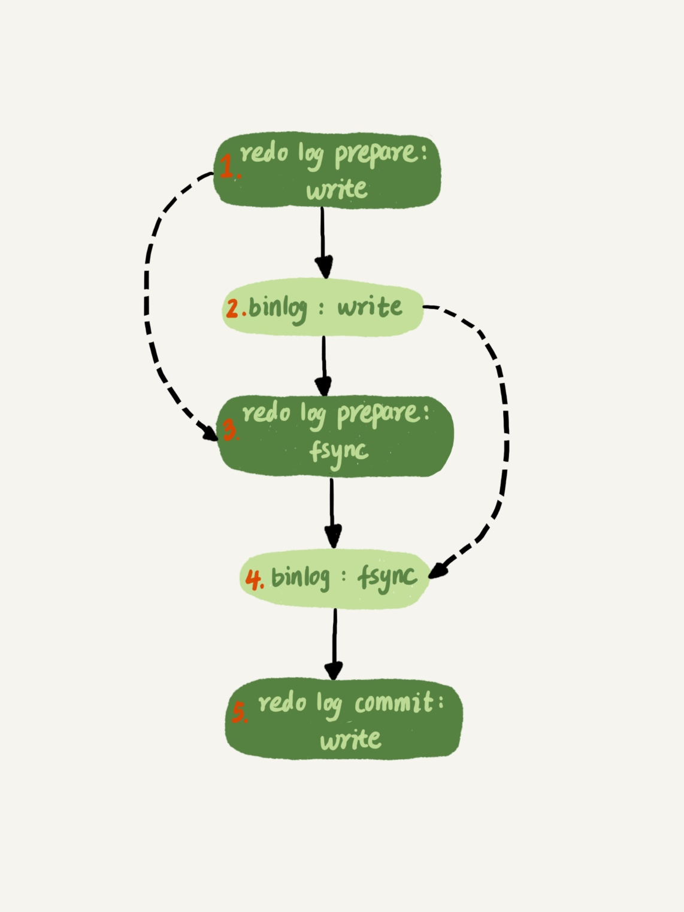

# redo log

## 作用
提高更新效率。
crash-safe能力：即使数据库发生异常重启，之前提交的记录都不会丢失。

## 容量
总文件数由参数innodb_log_files_in_group控制。一般为两个文件。
单文件大小由参数innodb_log_file_size控制。一般一个文件大小为1G。

## 工作原理
 
- write pos 是当前记录的位置
- checkpoint 是当前要擦除的位置
- 从头开始写，写到末尾就又回到开头循环写
       
## 特点
1. redo log 是 InnoDB 引擎特有的。
2. redo log 是物理日志，记录的是“在某个数据页上做了什么修改”。
3. redo log 是循环写的，空间固定会用完。

## 两阶段提交

### 两阶段提交细化

示例：update T set c=c+1 where ID=2;
上述语句执行过程如下：

    1. 执行器先找引擎取 ID=2 这一行。引擎直接用树搜索找到这一行。如果ID=2 这一行所在的数据页本来就在内存中，就直接返回给执行器；否则，需要先从磁盘读入内存，然后再返回。
    2. 执行器拿到引擎给的行数据，把这个值加上 1，比如原来是 N，现在就是 N+1，得到新的一行数据，再调用引擎接口写入这行新数据。
    3. 引擎将这行新数据更新到内存中，同时将这个更新操作记录到 redo log里面，此时 redo log 处于 prepare状态。
    4. 然后告知执行器执行完成了，随时可以提交事务。执行器生成这个操作的 binlog，并把 binlog 写入磁盘。
    5. 执行器调用引擎的提交事务接口，引擎把刚刚写入的 redo log 改成提交（commit）状态，更新完成。

## WAL
- 全称 write-ahead log
- 先写日志，再写磁盘。