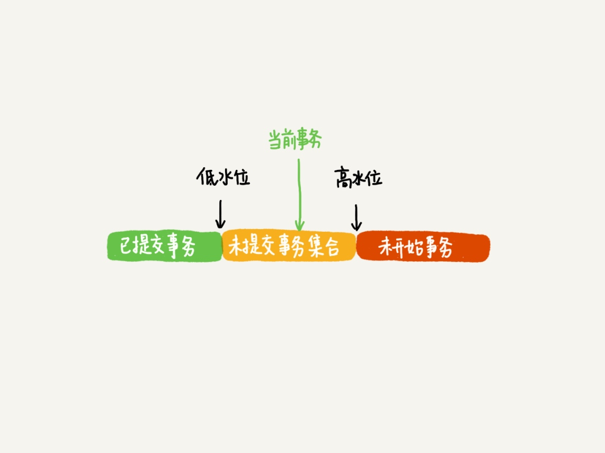

# 其他
## 事务ID【transaction id】
- 生成时机：事务开启时，向innodb申请
- 生成规则
    innodb内部维护了一个max_trx_id全局变量，每次需要申请一个新的trx_id,就会获得max_trx_id的值，然后加1
    最大值是2⁴⁸-1，达到最大值，从0开始
- 使用场景
    用于数据更新时生成新的数据版本，判断数据的可见性。
    
## 查询当前正在执行的事务

    select * from information_schema.innodb_trx;  
     
## 事务开启时机
- 没有显式地使用begin
    执行任意查询语句开启事务。
    
- 显式使用
    - begin/start transaction

            在执行第一条语句时开启事务。
            
    - start transaction with consistent snapshot

            立即开启事务。
            
## 事务提交时机
- 没有显式地使用begin，由参数autocommit控制
    - autocommit = 1 「默认」时
            
            当没有显式使用begin/commit时，表示这个语句本身就是一个事务，语句完成的时候会自动提交。

    - autocommit = 0 时

            将线程的自动提交关掉，执行任何一条语句时，事务就启动了。必需主动执行 commit 或 rollback。
            
- 显式使用
    commit时提交，rollback时回滚。
        
## MVCC 
用于支持提交读【RC】和可重复读【RR】隔离级别的实现。每行数据都有多个版本，历史版本的恢复有当前版本和undolog获取

## 一致性视图「read-view」
InnoDB 为每个事务构造了一个数组，用来保存这个事务启动瞬间，当前正在“活跃”的所有事务 ID。“活跃”指的就是，启动了但还没提交。
数组里面事务 ID 的最小值记为低水位，当前系统里面已经创建过的事务 ID 的最大值加 1 记为高水位。

- 开启了一致性读之后,在这个事务执行期间,不能释放空间,导致统计信息变大。

## 当前读
更新数据都是先读后写的，这个读只读当前的值【即数据最新版本】，称为当前读【current read】
除更新外，查询加锁也是当前读。

