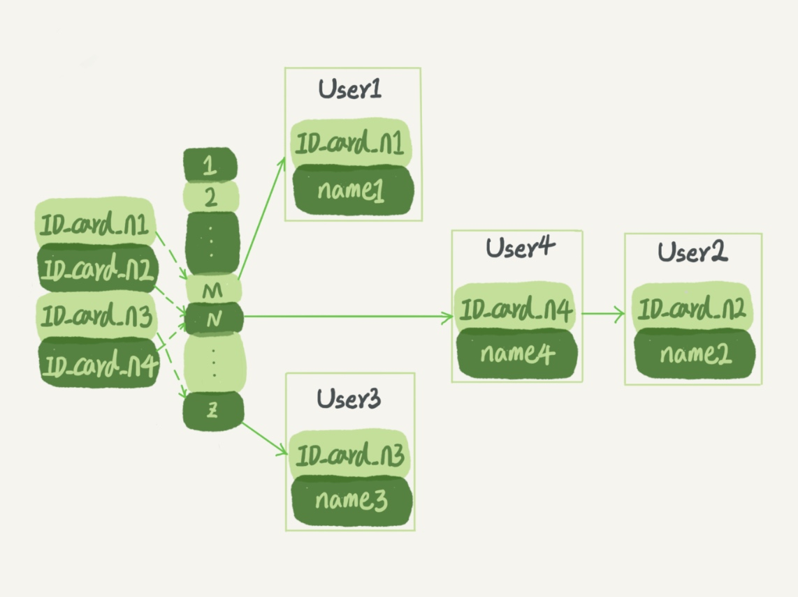
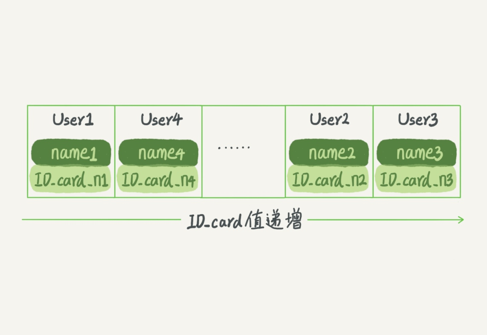
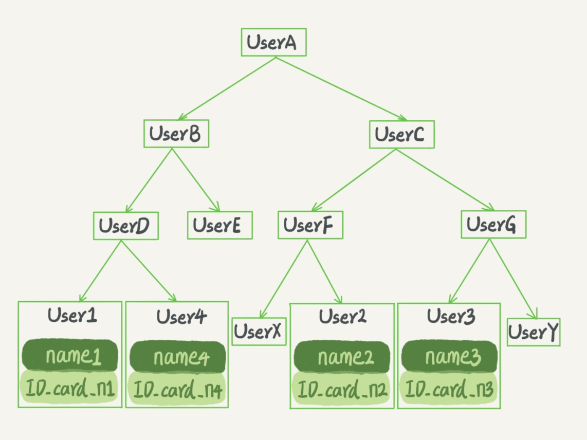
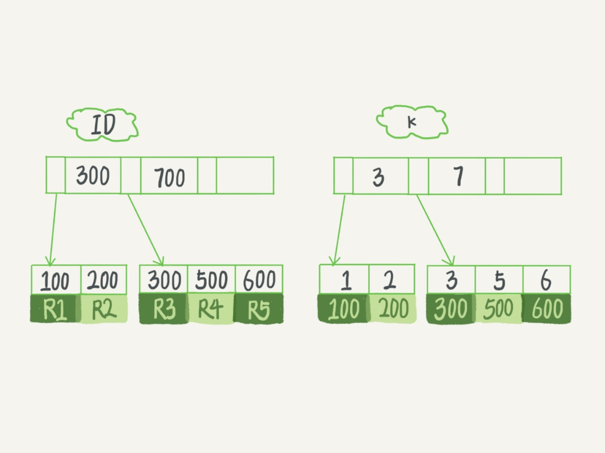

# 索引模型
## 哈希表
- 数据结构 key-value
  

- 适用场景
    等值查询，如Memcached

## 有序数组
- 数据结构

- 适用场景
    等值查询和范围查询，静态数据存储引擎
    
## 搜索树
- 数据结构

- 适用场景
  访问磁盘少，性能高，广泛应用于大多数数据库路
- 大部分索引不使用二叉树的原因：磁盘数据页。n叉树适配磁盘访问模式。
  
### B+树
- 数据结构

- 适用场景
    innodb存储引擎
    