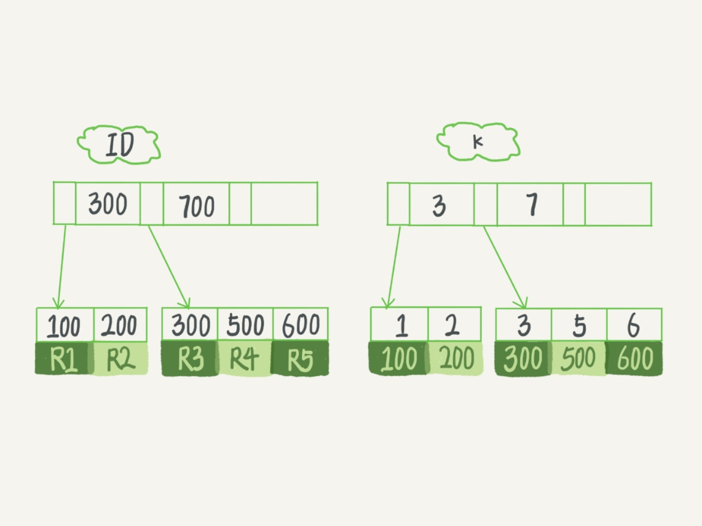

# Innodb

## 索引
B+树

## 表
索引组织表

## 特性
1. InnoDB 表的数据总是有序存放的。
2. 当数据文件有空洞的时候，InnoDB 表在插入新数据的时候，为了保证数据有序性，只能在固定的位置写入新值。
3. 数据位置发生变化的时候，InnoDB 表只需要修改主键索引。
4. InnoDB 表用主键索引查询时需要走一次索引查找，用普通索引查询的时候，需要走两次索引查找。
5. InnoDB 支持变长数据类型，不同记录的长度可能不同。