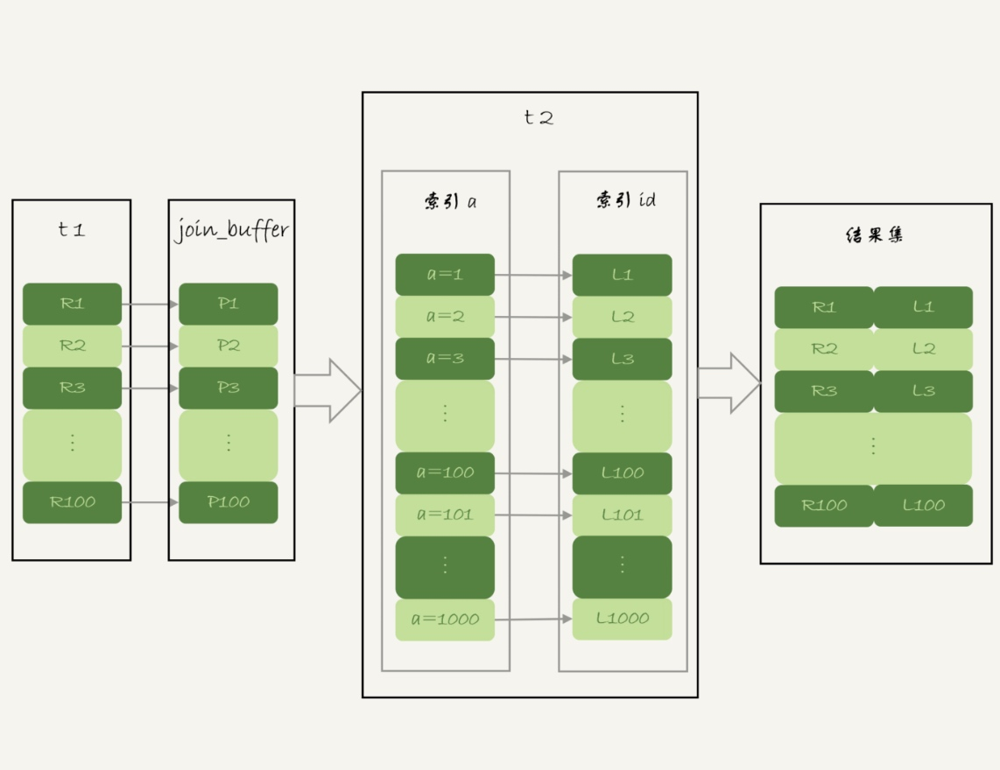

# join

## 选择驱动表
- Index Nested-Loop Join 算法，应该选择小表做驱动表。
- Block Nested-Loop Join 算法：
    - 在 join_buffer_size 足够大的时候，是一样的；
    - 在 join_buffer_size 不够大的时候（这种情况更常见），应该选择小表做驱动表。

## 算法

### NLJ【Index Nested-Loop Join】
可以使用被驱动表的索引，建议用小表做驱动表

    select * from t1 straight_join t2 on (t1.a=t2.a);[a在t1和t2表中是索引]
    
1. 从表t1中取读一行数据R
2. 从数据行R中取出字段a到表t2中查找
3. 取出表t2中满足条件的行，与R组成一行，作为结果集的一部分
4. 重复步骤1，2，3，直到表t1的末尾循环结束

### SNL [Simple Nested-Loop Join]
被驱动表使用不是索引，这个算法会导致驱动表每去被驱动表查一次，都要做全表扫描，mysql没有使用这个算法
    
    select * from t1 straight_join t2 on (t1.a=t2.b);
    
### BNL [Block Nested-Loop Join]
被驱动表上没有可用的索引，但是在内存中操作，速度快
情况一：驱动表占用内存 < join_buffer_size，大表和小表做驱动表，无差别
    
     select * from t1 straight_join t2 on (t1.a=t2.b);
1. 把表t1的数据读入线程内存join_buffer中，由于上面的语句写的是select *，所以要把整个表t放入内存中。
2. 扫描表t2，把t2中的每一行都取出来，和join_buffer中的数据做对比，满足join条件的作为结果集的一部分返回。

情况二：驱动表占用内存 > join_buffer_size，建议用小表做驱动表
1. 扫描表t1，顺序读取数据放入join_buffer中，假设（t1一共100行）放到第88行满了，继续第2步
2. 扫描表t2，把t2中的每一行都取出来，跟join_buffer中的数据做对比，满足join条件的，作为结果集的一部分返回
3. 清空join_buffer
4. 扫描表t1，把剩下的12行放入join_buffer中，继续执行第2步

#### BNL缺点
BNL 算法对系统的影响主要包括三个方面：
1. 可能会多次扫描被驱动表，占用磁盘 IO 资源；
2. 判断 join 条件需要执行 M*N 次对比（M、N 分别是两张表的行数），如果是大表就会占用非常多的 CPU 资源；
3. 可能会导致 Buffer Pool 的热数据被淘汰，影响内存命中率。使用BNL算法，会导致多次扫描被驱动表，如果被驱动表是一个冷表：
    - 冷表的数据量小于整个 Buffer Pool 的 3/8，如果语句执行时间超过 1 秒，就会在再次扫描冷表的时候，把冷表的数据页移到 LRU 链表头部。
    - 如果这个冷表很大，业务正常访问的数据页，没有机会进入 young 区域。

### BKA【Batched Key Access】
BKA算法是对NLJ算法的优化

开启BKA算法：
    
    set optimizer_switch='mrr=on,mrr_cost_based=off,batched_key_access=on';

### join优化
#### BNL转BKA
1. 把表t2中满足条件的数据放在临时表tmp_t中。
2. 为了让join使用BKA算法，给临时表tmp_t的字段b加上索引。
3. 让表t1和tmp_t做join操作

#### hash_join
join_buffer是无序的，如果支持hash，可以加快查询，mysql不支持，可以在业务端自己实现

