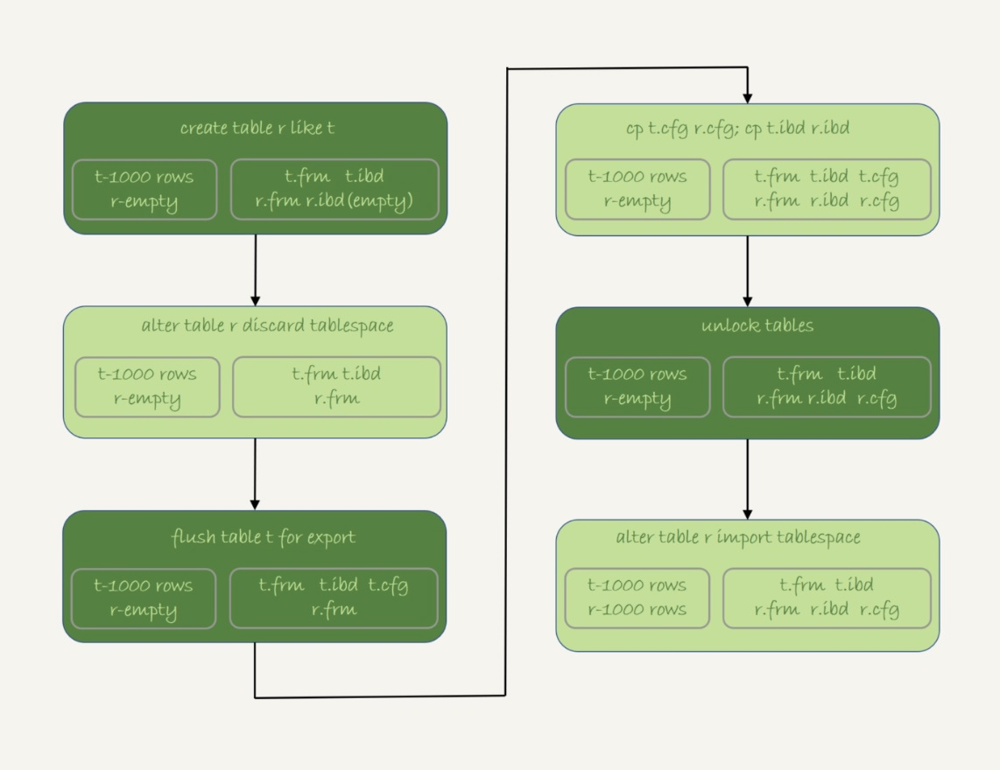

# 数据拷贝

## 逻辑拷贝

### mysqldump

#### 导出
    mysqldump -h$host -P$port -u$user --add-locks=0 --no-create-info --single-transaction  --set-gtid-purged=OFF db1 t --where="a>900" --result-file=/client_tmp/t.sql
    
1. --single-transaction：在导出数据的时候不需要对db1.t加表锁，而是使用 start transaction with consistent snapshot的方法。
2. --add_locks：设置为0，表示在输出的文件里，不增加"lock tables t write"。
3. --no-create-info：不需要导出表结构。
4. –set-gtid-purged=off：不输出跟 GTID 相关的信息；
5. --result-file：指定了输出文件的路径，其中 client 表示生成的文件是在客户端机器上的。
6. –-skip-extended-insert：一条 INSERT 语句只插入一行数据。
7. –-tab:同时导出表结构定义文件和 csv 数据文件

#### 导入
    mysql -h127.0.0.1 -P13000 -uroot dbname source -e 'path'

### csv
#### 导出
    select * from t into outfile 'path'
1. secure_file_priv设置为：
    - empty：表示不限制文件生成的位置，这是不安全的设置；
    - 一个表示路径的字符串：要求生成的文件只能放在这个指定的目录，或者它的子目录；
    - NULL：表示禁止在这个 MySQL 实例上执行 select … into outfile 操作。
    
#### 导入
    load data infile 'path' into table database.tablename
    
## 物理拷贝
1. 执行 create table r like t，创建一个相同表结构的空表；
2. 执行 alter table r discard tablespace，这时候 r.ibd 文件会被删除；
3. 执行 flush table t for export，这时候 db1 目录下会生成一个 t.cfg 文件；
4. 在 db1 目录下执行 cp t.cfg r.cfg; cp t.ibd r.ibd；这两个命令（这里需要注意的是，拷贝得到的两个文件，MySQL 进程要有读写权限）；
5. 执行 unlock tables，这时候 t.cfg 文件会被删除；
6. 执行 alter table r import tablespace，将这个 r.ibd 文件作为表 r 的新的表空间，由于这个文件的数据内容和 t.ibd 是相同的，所以表 r 中就有了和表 t 相同的数据。

注意点：
1. 在第 3 步执行完 flsuh table 命令之后，db1.t 整个表处于只读状态，直到执行 unlock tables 命令后才释放读锁；
2. 在执行 import tablespace 的时候，为了让文件里的表空间 id 和数据字典中的一致，会修改 r.ibd 的表空间 id。而这个表空间 id 存在于每一个数据页中。因此，如果是一个很大的文件（比如 TB 级别），每个数据页都需要修改，所以你会看到这个 import 语句的执行是需要一些时间的。当然，如果是相比于逻辑导入的方法，import 语句的耗时是非常短的。