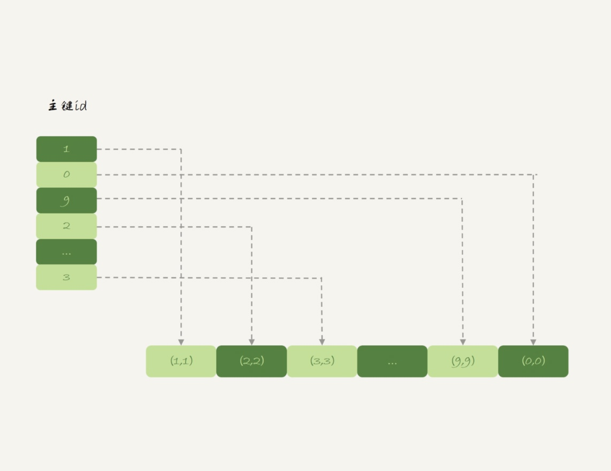

# Memory

## 索引
1. 默认：hash索引

## 表
堆组织表
内存表的数据部分以数组的方式单独存放

## 特性
1. 内存表的数据就是按照写入顺序存放的。
2. 当数据文件有空洞的时候，内存表找到空位就可以插入新值。
3. 数据位置发生变化的时候，内存表需要修改所有索引。
4. 内存表所有索引的“地位”都是相同的。
5. 内存表不支持 Blob 和 Text 字段，并且即使定义了 varchar(N)，实际也当作 char(N)，也就是固定长度字符串来存储，因此内存表的每行数据长度相同。