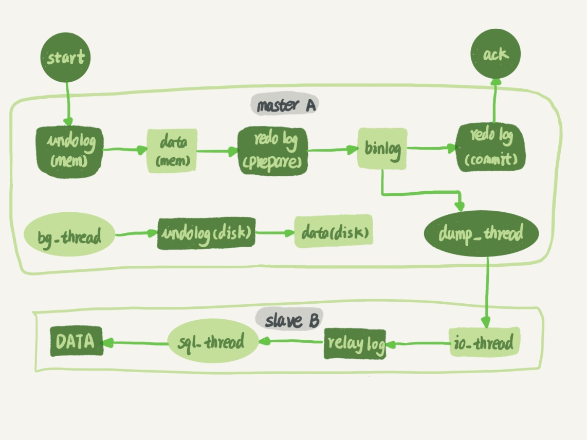
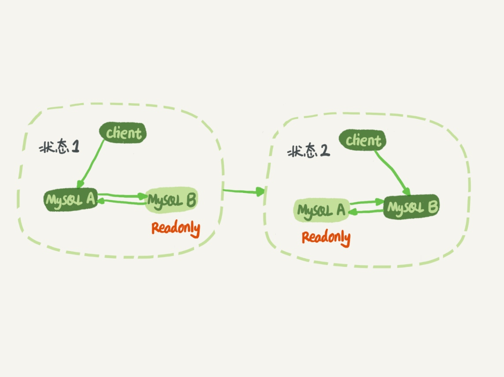

# 主备同步原理
## 主备同步流程【M-S】

1. 在备库B上通过change master命令，设置主库 A 的 IP、端口、用户名、密码，以及要从哪个位置开始请求 binlog，这个位置包含文件名和日志偏移量。
        
        CHANGE MASTER TO
        MASTER_HOST='IP', 
        MASTER_PORT=PORT,
        MASTER_USER='USERNAME',
        MASTER_PASSWORD='PASSWORD',
        master_auto_position=1(基于GTID同步)
2. 在备库B上执行`start slave`命令，这时候备库会启动两个线程，io_thread和sql_thread，其中io_thread负责与主库建立连接。
3. 主库 A 校验完用户名、密码后，开始按照备库 B 传过来的位置，从本地读取 binlog，发给 B。
4. 备库B拿到binlog后，写成本地文件，称为中转日志（relay log）。
5. sql_thread读取中转日志，解析出日志里的命令，并执行。

## 主备同步流程【M-M】

1. 从节点 A 更新的事务，binlog 里面记的都是 A 的 server id；
2. 传到节点 B 执行一次以后，节点 B 生成的 binlog 的 server id 也是 A 的 server id；
3. 再传回给节点 A，A 判断到这个 server id 与自己的相同，就不会再处理这个日志。所以，死循环在这里就断掉了。