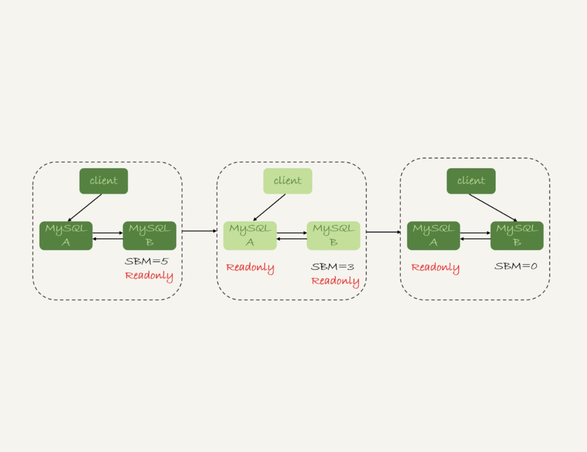

# 主备切换
- 一般是由专门的 HA 系统来完成的
- mysql高可用的基础，就是主备切换的逻辑

## 主备延迟

    执行show master status；
    字段seconds_behind_master表示备库延迟的时间（单位秒）
延时原因：
1. 备库所在机器的性能比主库差
2. 备库的压力大
3. 大事务
4. 备库的并行复制能力

## 主动切换

### 可靠性优先策略
这个策略切换过程中，存在数据库不可用时间

1. 判断备库B现在的seconds_behind_master，如果小于某个值，继续下一步，否则持续重试这一步。
2. 把主库A readonly设置为true。
3. 判断备库B的seconds_behind_master的值，直到变为0为止。
4. 把备库B的readonly设置为false。
5. 把业务请求切换到B。

### 可用性优先策略
可能会出现数据不一致的情况
1. 把备库B的readonly设置为false。
2. 把业务请求切换到B。

## 被动切换【异常切换】
在满足数据可靠性的前提下，mysql高可用系统的可用性，是依赖于主备延迟的，延迟的时间越短，在主库故障的时候，服务恢复需要的时间就越短，可用性就越高。

