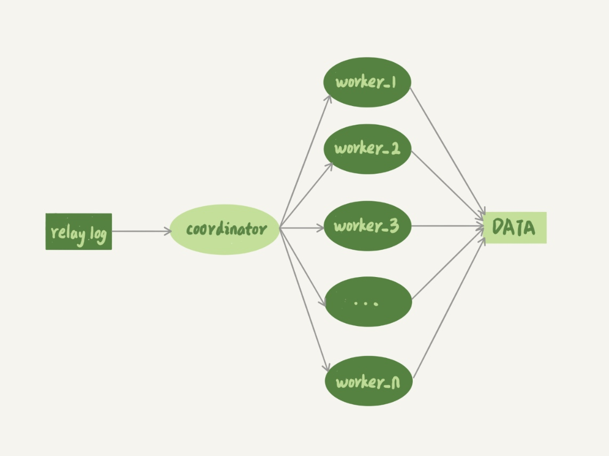

# 备库并行复制能力
备库上 sql_thread 更新数据，如果用单线程的话，就会导致备库应用日志不够快，造成主备延迟。

## MySQL多线程复制的演进过程
多线程复制都是要把原来只有一个线程的 sql_thread，拆成多个线程，如图：

上图中coordinator 在分发的时候，需要满足以下这两个基本要求：
1. 不能造成更新覆盖：要求更新同一行的两个事务，必需分到同一个worker。
2. 同一个事务不能被拆开，必需放到用一个worker中。

### 5.6 版本之前
只支持单线程复制

### MySQL 5.6 版本的并行复制策略
支持按库并行，不要求binlog的格式

### MariaDB 的并行复制策略
过程：
1. 在一组里面一起提交的事务，有一个相同的commit_id，下一组就是commit_id + 1。
2. commit_id直接写到binlog里面。
3. 传到备库应该的时候，相同的commit_id分发到不同的worker中执行。
4. 这一组全部执行完成后，coordinator再去取下一组
缺陷：
在备库执行的时候，必需一组执行完，才能执行下一组，这样系统的吞吐量不够，这个方案也很容易受大事务的影响。

### MySQL 5.7 的并行复制策略
由参数slave-parallel-type来控制
1. 配置为 DATABASE，表示使用5.6的策略
2. 配置为 LOGICAL_CLOCK，表示类似MariaDB的策略，但做了优化
   1. 同时处于 prepare 状态的事务，在备库执行时是可以并行的；
   2. 处于 prepare 状态的事务，与处于 commit 状态的事务之间，在备库执行时也是可以并行的。

### MySQL 5.7.22 的并行复制策略
基于 WRITESET 的并行复制
由binlog-transaction-dependency-tracking参数控制：
1. COMMIT_ORDER：根据同时进入prepare和commmit来判断是否可以并行。
2. WRITESET：对于事务涉及更新的每一行，计算出这一行的 hash 值，组成集合 writeset。如果两个事务没有操作相同的行，也就是说它们的 writeset 没有交集，就可以并行。
3. WRITESET_SESSION：在 WRITESET 的基础上多了一个约束，即在主库上同一个线程先后执行的两个事务，在备库执行的时候，要保证相同的先后顺序

