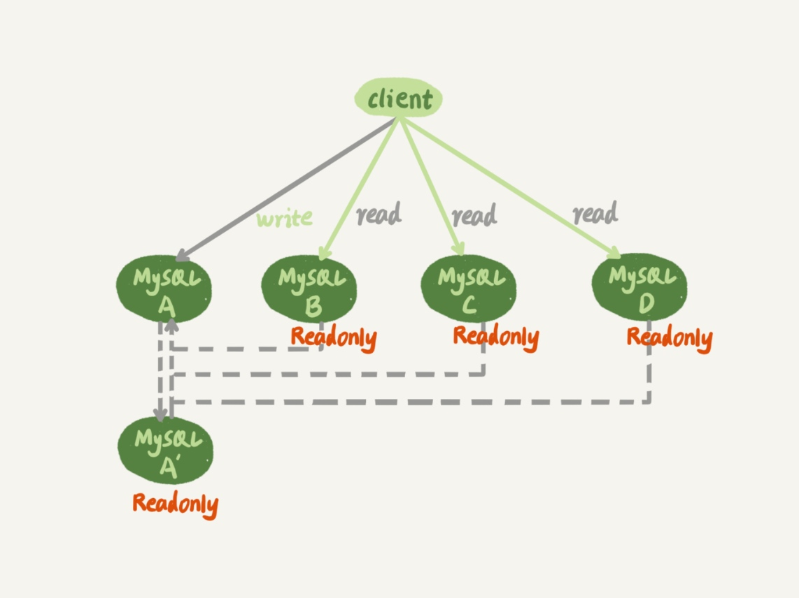
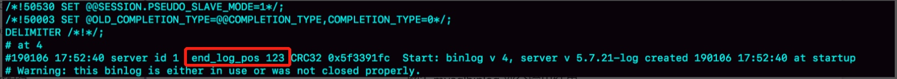

# 一主多从
用来解决读多写少带来的读性能问题
## 架构图

## 切换策略
### 基于位点
1. A' 延迟时间变为0，把readonly改成false，把连接切到A'
2. 取A故障时间T，解析A'binlog，获取T时刻的位点
    - 命令：mysqlbinlog File --stop-datetime=T --start-datetime=T
    - 结果：
3. 在从库执行change master 命令，MASTER_LOG_FILE和MASTER_LOG_POS设置为步骤2查到的位点。
4. 通常情况下，我们在切换任务的时候，要先主动跳过这些错误，有两种常用的方法：
    1. 主动跳过一个事务
       命令：set global sql_slave_skip_counter=1;
            start slave;
    2. 设置 slave_skip_errors 参数：
       - 1062 错误是插入数据时唯一键冲突；
       - 1032 错误是删除数据时找不到行。
       
### 基于GTID 
#### GTID
- 全称：GLOBAL Transaction Identifier
- 格式：GTID = server_uuid:gno
- 启动方式：在my.conf里配置 gtid_mode=on 和 enforce_gtid_consistency=on
- 生成方式，取决于session变量gtid_next的值
    1. 默认：gtid_next=automatic，

            MySQL 就会把 server_uuid:gno 分配给这个事务。
            a. 记录 binlog 的时候，先记录一行 SET @@SESSION.GTID_NEXT=‘server_uuid:gno’;
            b. 把这个 GTID 加入本实例的 GTID 集合。
    2. gtid_next是一个指定的值，通过 set gtid_next='current_gtid’指定为 current_gtid
            
            a. 如果 current_gtid 已经存在于实例的 GTID 集合中，接下来执行的这个事务会直接被系统忽略；
            b. 如果 current_gtid 没有存在于实例的 GTID 集合中，就将这个 current_gtid 分配给接下来要执行的事务，也就是说系统不需要给这个事务生成新的 GTID，因此 gno 也不用加 1。
- 主键冲突解决办法：
        
        set gtid_next='冲突事务的GTID';
        begin;
        commit;
        set gtid_next=automatic;
        start slave;      
            
#### 切换流程
1. 主库A'为从库B设置用户并且分配权限
        
        create user 'repluser'@'%' identified by '123456';
        grant replication slave on *.* to 'repluser'@'%';
2. 从库执行change master命令
        
        CHANGE MASTER TO        
        MASTER_HOST=$host_name 
        MASTER_PORT=$port 
        MASTER_USER=$user_name 
        MASTER_PASSWORD=$password 
        master_auto_position=1
3. 从库执行命令start slave:
        已知：实例 A’的 GTID 集合记为 set_a，实例 B 的 GTID 集合记为 set_b
        
        1. 从库实例 B指向主库，基于主备协议建立连接
        2. 实例 B把set_b发给A'。
        3. 实例 A’算出 set_a 与 set_b 的差集，也就是所有存在于 set_a，但是不存在于 set_b 的 GTID 的集合，判断 A’本地是否包含了这个差集需要的所有 binlog 事务。
            a. 如果不包含，表示 A’已经把实例 B 需要的 binlog 给删掉了，直接返回错误；
            b. 如果确认全部包含，A’从自己的 binlog 文件里面，找出第一个不在 set_b 的事务，发给 B
        5. 之后就从这个事务开始，往后读文件，按顺序取 binlog 发给 B 去执行。