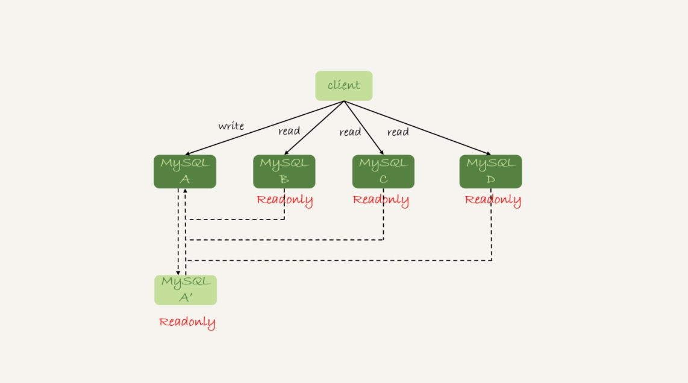
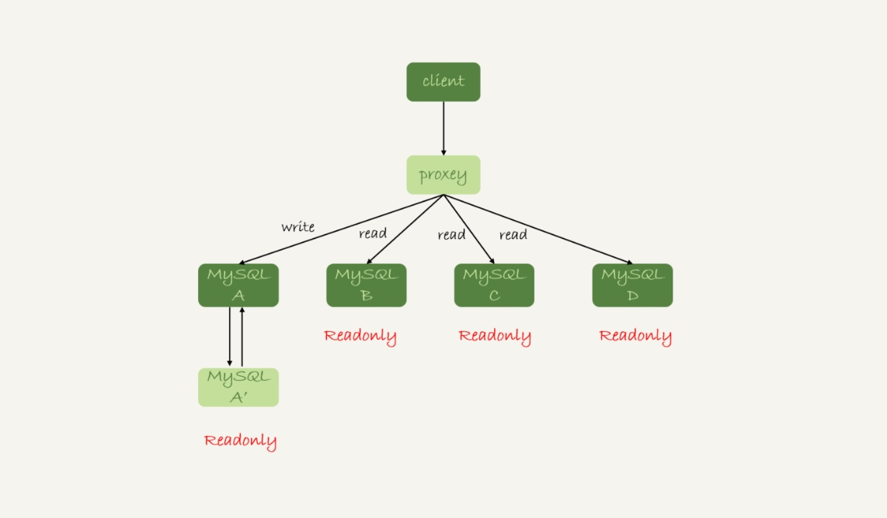
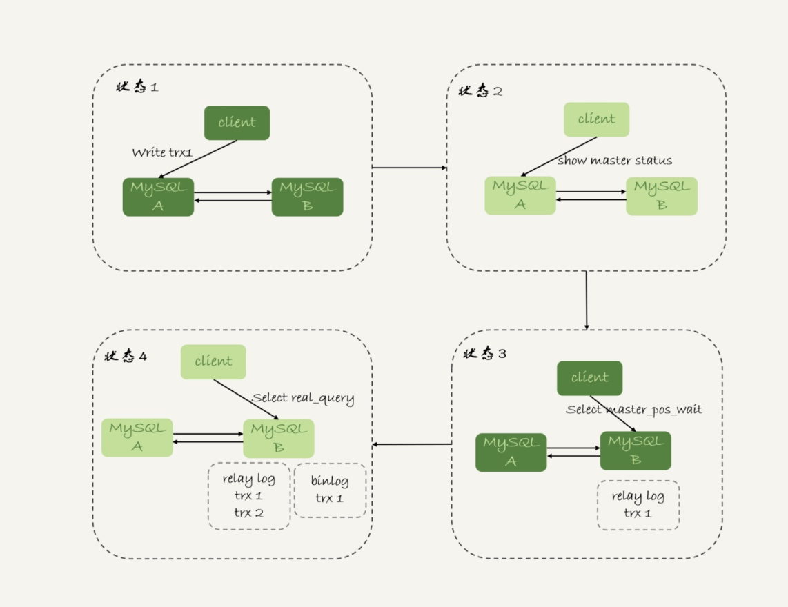
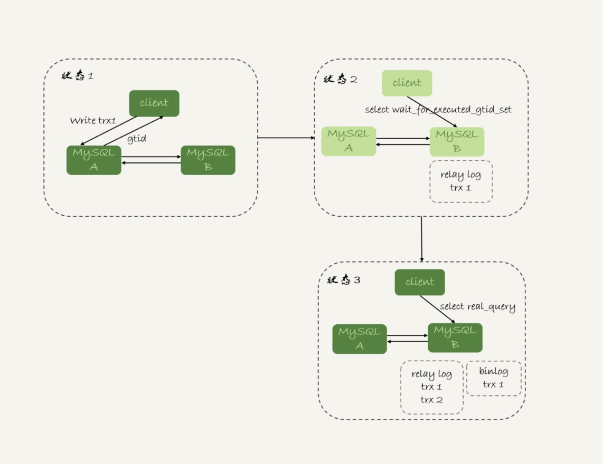

# 读写分离
是一主多从架构的一种应用场景。
## 读写分离基本架构
架构一：

  
架构二：

## 过期读
    由于主从可能存在延迟，客户端执行完一个更新事务后马上发起查询，如果查询选择的是从库的话，就有可能读到刚刚的事务更新之前的状态，把这种现象称为`过期读`   
### 处理方案

#### 强制走主库方案
查询必需获取最新结果的情况

#### Sleep 方案
主库更新后，读从库之前先 sleep 一下

#### 判断主备无延迟方案
1. seconds_behind_master=0后再查询
2. Master_Log_File 和 Relay_Master_Log_File、Read_Master_Log_Pos 和 Exec_Master_Log_Pos 这两组值完全相同，再查询
3. Retrieved_Gtid_Set和Executed_Gtid_Set这两个集合相同，再查询

#### 配合 semi-sync【半同步复制】
过程：
1. 事务提交的时候，主库把binlog发给从库。
2. 从库收到binlog之后，给主库回一个ack，表示收到了。
3. 主库收到ack后，才能给客户端返回"事务完成"的确认。
缺点：
1. semi-sync+位点判断的方案只适用于一主一备，一主多从的时候，在某些从库执行查询请求会存在过期读的现象。
2. 在持续延迟的情况下，可能出现过度等待的问题。

#### 等主库位点方案
过程：
1. 一个事务更新完成后，马上执行show master status得到当前主库执行的FILE和POSITION。
2. 选定一个从库执行查询语句。
3. 在从库上执行select master_pos_wait(File,Position,1);
4. 如果返回值是>=0的整数，则在从库查询。
5. 否则，到主库查询语句。

缺点：
如果从库查询都超时，在压力会都到主库上

#### GTID 方案
过程：
1. 事务更新完成后，从返回包直接获取这个事务的GTID，记为gtid1。将参数session_track_gtids设置为 OWN_GTID，然后通过 API 接口 mysql_session_track_get_first 从返回包解析出 GTID 的值即可。
2. 选定一个从库执行查询语句。
3. 在从库上执行select wait_for_executed_gtid_set(gtid1,1)。
4. 如果返回值是0，则在这个从库上执行查询语句。
5. 否则，在主库执行查询语句。

