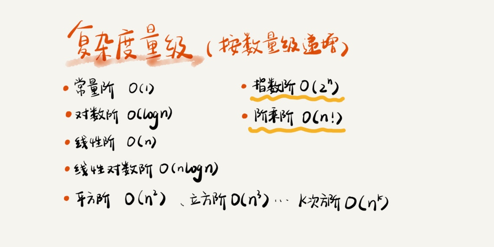

# 时间复杂度
时间渐进复杂度，表示算法的执行时间和数据规模之间的关系。

## 分析方法
- 只关注循环执行次数最多的一段代码。
- 加法法则
    
        总复杂度等于量级最大的那段代码的复杂度。 
        如果 T1(n)=O(f(n))，T2(n)=O(g(n))；
        那么 T(n)=T1(n)+T2(n)=max(O(f(n)), O(g(n))) =O(max(f(n), g(n)))。
- 乘法法则

        嵌套代码的复杂度等于嵌套内外代码复杂度的乘积。
        如果 T1(n)=O(f(n))，T2(n)=O(g(n))；
        那么 T(n)=T1(n)*T2(n)=O(f(n))*O(g(n))=O(f(n)*g(n))。
        
## 高阶分析
- 在大多数情况下，不需要区分最好、最坏、平均情况时间复杂度三种情况。
- 同一块代码在不同的情况下，时间复杂度有量级的差距，我们才会使用这三种复杂度表示法来区分。

### 最好情况时间复杂度
在最理想的情况下，执行这段代码的时间复杂度。

### 最坏情况时间复杂度
在最糟糕的情况下，执行这段代码的时间复杂度。

### 平均情况时间复杂度
- 也叫做`加权平均时间复杂度`或者`期望时间复杂度`。
- 计算方法：

        各情况的概率 * 该情况代码执行次数 的积 相加。

### 均摊时间复杂度
- 是一种特殊的平均时间复杂度。
- 分析方法：摊还分析法。
- 使用场景：

        大部分情况下时间复杂度都很低，只有个别情况下时间复杂度比较高，而且这些操作之间存在前后连贯的时序关系。
        能够应用均摊时间复杂度分析的场合，一般均摊时间复杂度就等于最好情况时间复杂度。
- 计算方法：
    
        最坏情况时间复杂度/总情况

## 复杂度量级

- 复杂度量级分为两类：
    - 多项式量级。
    - 非多项式量级：O(2**n)、O(n!)
    
            非多项式量级的算法问题叫作 NP（Non-Deterministic Polynomia）问题。

### 常量阶 【O(1)】
只要算法中不存在循环语句、递归语句，即使有成千上万行的代码，其时间复杂度也是Ο(1)。

### 对数阶 【O(logn)、O(nlogn)】
- 常见，最难分析的一种。
- log3n 就等于 log32 * log2n，所以 O(log3n) = O(C * log2n)，其中 C=log32 是一个常量。所以不管以什么为底【系数】，可以把所有对数阶的时间复杂度都记为 O(logn)。
- 归并排序、快速排序的时间复杂度都是 O(nlogn)。

### 多数据规模 【O(m+n)、O(m*n)】
- m 和 n 是表示两个数据规模。我们无法事先评估 m 和 n 谁的量级大，所以在表示复杂度的时候，不能省略掉其中一个。
- 加法规则：T1(m) + T2(n) = O(f(m) + g(n))。
- 乘法法则：T1(m) * T2(n) = O(f(m) * f(n))。