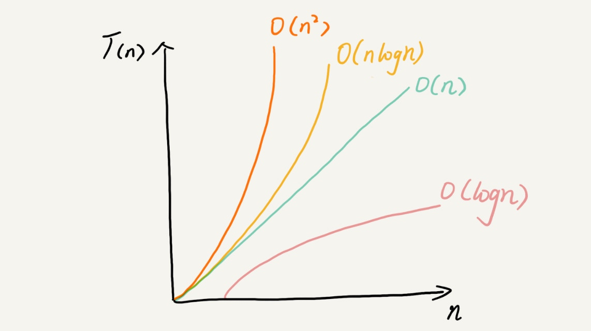

# 复杂度
渐进复杂度，包括时间复杂度和空间复杂度

## 统计方法
- 事后统计法。

        1. 测试结果非常依赖测试环境。
        2. 测试结果受数据规模的影响很大。
- 事前统计法。
        
        大O表示法。
        所有代码的执行时间 T(n) 与每行代码的执行次数 n 成正比。

## 量级

## 执行效率与阶数

从低阶到高阶：O(1)、O(logn)、O(n)、O(nlogn)、O(n2)。