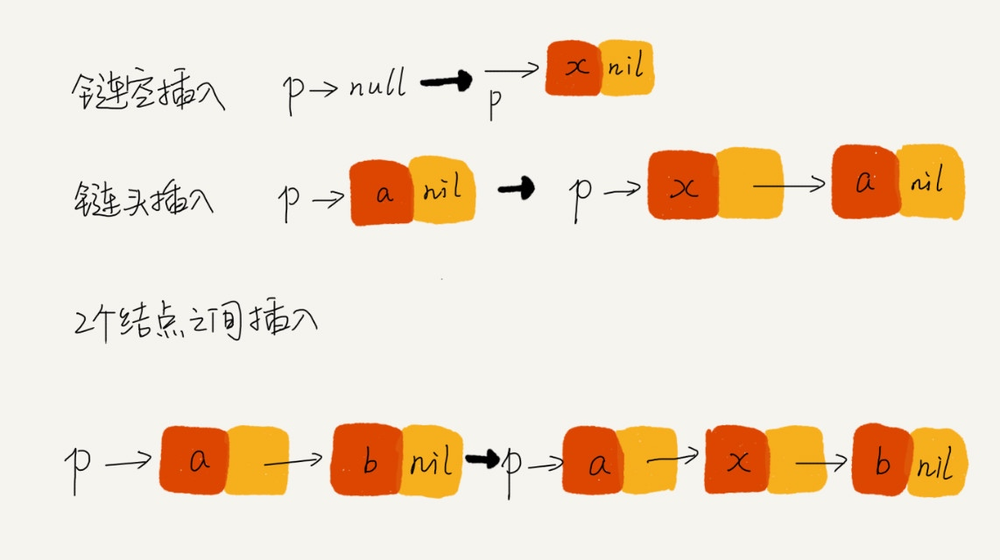

# 链表
- 通过“指针”将一组零散的内存块串联起来使用。

## 单链表

1. 由结点（内存块）串联起来，每个链表的结点除了存储数据之外，还需要记录链上的下一个结点的地址。
2. 每个结点都有一个后继结点。
3. 链表中的第一个结点称为头结点，用来记录链表的基地址。
4. 最后一个结点称为尾结点，指向一个空地址NULL。

## 双链表

1. 每个结点不止有一个后继指针 next 指向后面的结点，还有一个前驱指针 prev 指向前面的结点。
2. 双向链表在某些情况下的插入、删除等操作都要比单链表简单、高效，如下：
        
        1. 删除：
        （1）删除结点中“值等于某个给定值”的结点：
            不管是单链表还是双向链表，为了查找到值等于给定值的结点，都需要从头结点开始遍历，直到找到值等于给定值的结点，将其删除。
            尽管单纯的删除操作时间复杂度是 O(1)，但遍历查找的时间是主要的耗时点，时间复杂度为 O(n)。根据时间复杂度分析中的加法法则，总时间复杂度为O(n)。
        （2）删除结点中“值等于某个给定值”的结点：
            删除某个结点q需要知道其前驱结点，而单链表并不支持直接获取前驱结点，要从头结点开始遍历链表，找到前驱结点。
            但是双向链表已经保存了前驱结点的指针，不需要遍历。
            单链表删除操作需要 O(n)的时间复杂度，而双向链表是O(1)
        2. 插入：

            同理上述删除的场景，在链表的某个指定结点前面插入一个结点，双向链表间复杂度：O(1)，而单向链表时间复杂度：O(n)。
            
        3. 查找：

            对于一个有序链表，双向链表的按值查询的效率也要比单链表高一些。因为，我们可以记录上次查找的位置 p，每次查询时，根据要查找的值与 p 的大小关系，决定是往前还是往后查找，所以平均只需要查找一半的数据。

        

## 循环链表

1. 链表的尾结点指向链表的头结点。
2. 当要处理的数据具有环型结构特点时，就特别适合采用循环链表。

## 双向循环链表

循环链表和双向链表整合在一起，形成双向循环链表。

## 使用场景
### LRU（Least Recently Used）缓存淘汰算法
- 基本思想
    1. 维护一个有序单链表，越靠近链表尾部的结点是越早之前访问的。
    2. 当有一个新的数据被访问时，从链表头开始顺序遍历链表。
        1. 如果此数据之前已经被缓存在链表中了，我们遍历得到这个数据对应的结点，并将其从原来的位置删除，然后再插入到链表的头部。
        2. 如果此数据没有在缓存链表中，分为两种情况：
            1. 如果此时缓存未满，则将此结点直接插入到链表的头部；
            2. 如果此时缓存已满，则链表尾结点删除，将新的数据结点插入链表的头部。
- 优化
    - 基于链表的实现思路，缓存访问的时间复杂度为 O(n)。可以引入散列表（Hash table）来记录每个数据的位置，将缓存访问的时间复杂度降到 O(1)。
    
### java中LinkedHashMap 用到了双向链表这种数据结构。

## 写链表的技巧
### 技巧一：理解指针或引用的含义
- 将某个变量赋值给指针，实际上就是将这个变量的地址赋值给指针。

### 技巧二：警惕指针丢失和内存泄漏
- 写链表代码的时候，指针指来指去，一会儿就不知道指到哪里了。所以，在写的时候，一定注意不要弄丢了指针。
- 指针丢失的场景：

    
若代码写成：

        p->next = x; // 将p的next指针指向x结点；
        x->next = p->next; // 将x的结点的next指针指向b结点；
错误解析：
        
        p->next 指针在完成第一步操作之后，已经不再指向结点 b 了，而是指向结点 x。
        第 2 行代码相当于将 x 赋值给 x->next，自己指向自己。
        因此，整个链表也就断成了两半，从结点 b 往后的所有结点都无法访问到了。
        
    总结：
    
        插入结点时，一定要注意操作的顺序，要先将结点 x 的 next 指针指向结点 b，再把结点a的next指针指向结点x，这样才不会丢失指针，导致内存泄漏。
        删除结点时，也一定要记得手动释放内存空间，否则，也会出现内存泄漏的问题。
    
### 技巧三：利用哨兵简化实现难度
- 有哨兵结点的链表叫带头链表。相反，没有哨兵结点的链表就叫作不带头链表。

### 技巧四：重点留意边界条件处理
- 软件开发中，代码在一些边界或者异常情况下，最容易产生 Bug。要实现没有 Bug 的链表代码，一定要在编写的过程中以及编写完成之后，检查边界条件是否考虑全面，以及代码在边界条件下是否能正确运行。
- 用来检查链表代码是否正确的边界条件有这样几个：
    - 如果链表为空时，代码是否能正常工作？
    - 如果链表只包含一个结点时，代码是否能正常工作？
    - 如果链表只包含两个结点时，代码是否能正常工作？
    - 代码逻辑在处理头结点和尾结点的时候，是否能正常工作？
- 当你写完链表代码之后，除了看下你写的代码在正常的情况下能否工作，还要看下在上面几个边界条件下，代码仍然能否正确工作。如果这些边界条件下都没有问题，那基本上可以认为没有问题了。
    
### 技巧五：举例画图，辅助思考
举例法和画图法
- 比如往单链表中插入一个数据这样一个操作，把各种情况都举一个例子，画出插入前和插入后的链表变化，如图所示：

看图写代码，就容易多了。

### 技巧六：多写多练，没有捷径
- 熟能生巧

## 相关算法
- 用链表实现LRU算法。
- 判断一个链表是否是回文。
- 反转链表。
- 删除链表的倒数第N个结点。
- 求链表的中间结点。
- 判断一个链表是否有环，若有，求环长和头结点距离环口多远。
- 有序链表合并。

## 数组和链表的比较

1. 从底层的`存储结构`看，数据需要一块连续的内存空间来存储，而链表恰恰相反，并不需要一块连续的内存空间，它通过指针将一些零散的内存快串联起来。
2. 从`数据的操作`来看：
    1. 数组插入和删除时，为了`保证内存的连续性`，需要做大量的`数据搬移`，所以时间复杂度是`O(n)`；而在链表中插入或者删除一个数据，我们并不需要为了保持内存的连续性而搬移结点，因为链表的存储空间本身就`不是连续的`。所以，在链表中插入和删除一个数据是`非常快速`的，时间复杂度是`O(1)`。
    2. 数组在访问某一个元素时，比如访问数组中第K个元素，可以根据首地址和下标，通过`寻址公式就能直接计算出对应的内存地址`，时间复杂度为`O(1)`；而链表要想随机访问第k个元素，就没有数组那么高效了。因为链表中的数据并非连续存储的，需要根据指针一个结点一个结点地`依次遍历`，直到找到相应的结点。所以，链表随机访问的性能没有数组好，需要`O(n)`的时间复杂度。