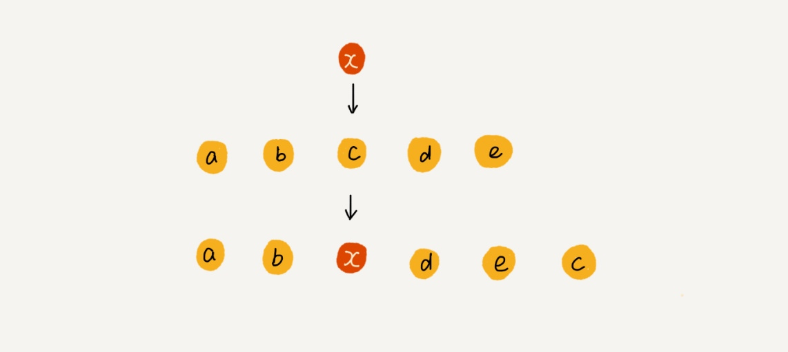
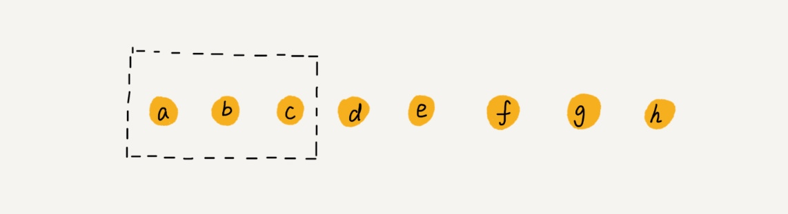

# 数组
- 用一组连续的内存空间，来存储一组具有相同类型的数据。
- 数组支持随机访问。
- 链表适合插入、删除，时间复杂度 O(1)；数组适合查找，查找时间复杂度为 O(1)【表述不准确】

## 性能提速

### 插入

直接将第 k 位的数据搬移到数组元素的最后，把新的元素直接放入第 k 个位置。

### 删除

1. 先记录下已经删除的数据。
2. 每次的删除操作并不是真正地搬移数据，只是记录数据已经被删除。
3. 当数组没有更多空间存储数据时，再触发执行一次真正的删除操作

## 警惕
- 数组越界