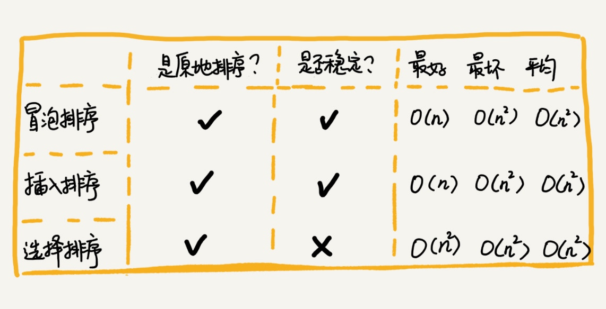

# 排序

## 分析&评价一个排序算法
执行效率、内存消耗和稳定性三个方面。

## 基于比较

### 有序度
- 有序度是数组中具有有序关系的元素对的个数。

        有序元素对：a[i] <= a[j], 如果i < j。
- 逆序度。

        有序元素对：a[i] <= a[j], 如果i < j。
- 逆序度 = 满有序度 - 有序度。     
        
### 算法
- 冒泡排序【Bubble Sort】

        操作相邻的两个数据。
        每次冒泡操作都会对相邻的两个元素进行比较，看是否满足大小关系要求。
        如果不满足就让它俩互换。
- 插入排序【Insertion Sort】

        取未排序区间中的元素，在已排序区间中找到合适的插入位置将其插入，并保证已排序区间数据一直有序。
        重复这个过程，直到未排序区间中元素为空，算法结束。
- 选择排序

        选择排序每次会从未排序区间中找到最小的元素，将其放到已排序区间的末尾。
- 希尔排序【Shell Sort】

        把记录按下标的一定增量分组，对每组使用直接插入排序算法排序；
        随着增量逐渐减少，每组包含的关键词越来越多，当增量减至1时，整个文件恰被分成一组，算法便终止。

