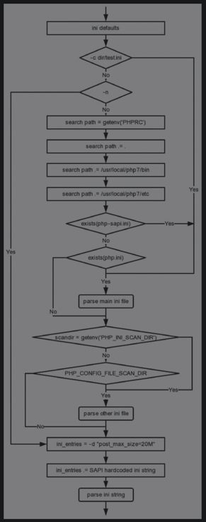

# 配置文件加载
- -c：指定配置文件
- -d：指定配置参数
- -n：忽略配置文件

## 初始化默认配置
如果当前SAPI存在默认配置的初始化函数，则调用该函数来初始化默认配置。

## 初始化extension_lists
来保存配置文件中的扩展。

## 解析主配置文件
- 使用-c指定的配置文件，使用该方式指定后不再搜索后边的目录，配置文件名可以自定义。
- 使用PHPRC环境变量指定的配置文件，配置文件名可以自定义，-n参数下无效。
- 在当前目录下搜索，-n参数下无效。
- 在PHP安装目录bin和etc下搜索，-n参数下无效。
- 第2、3、4三种方式指定的目录下，如果php-${sapi}.ini存在，使用这个配置文件，如php-cli.ini，否则使用php.ini。

## 解析其他配置文件
- 在安装PHP时由--with-config-file-scan-dir参数指定扩展配置文件的目录。
- 如果在安装时没有添加--with-config-file-scan-dir参数并且环境变量中存在PHP_INI_SCAN_DIR，则在该路径下寻找。

## 解析配置字符串
