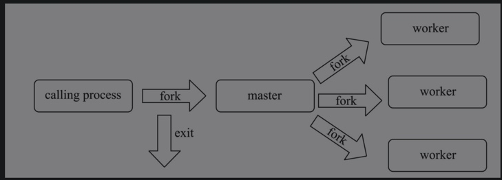
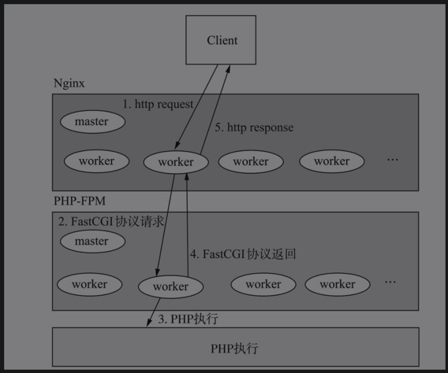

# FPM的生命周期

    与CLI模式类似，FPM模式的生命周期也有5个阶段，
    但是又与CLI模式的生命周期不同，因为FPM是常驻内存的进程，所以其模块初始化只做一次，便进入循环，而模块关闭在进程退出时也只做一次

1. 调用php_module_startup，加载所有模块。
2. 进入循环，调用fcgi_accept_request实际调用的是accept，阻塞等待请求；如果有请求进来，会被唤起，进入php_request_startup，初始化请求。
3. 进入php_execute_script，对脚本执行编译。
4. 调用php_request_shutdown关闭请求，继续进入循环。
5. 如果进程退出，调用php_module_shutdown关闭所有模块。
6. 如果请求次数大于max_requests，则跳转5。

## 多进程管理
PHP-FPM是多进程的服务，其中有一个master进程（做管理工作）和多个worker进程（处理数据请求）。

### 进程创建
一般情况下，Nginx会根据服务器的CPU内核数设置worker的进程数。



#### 子进程设置方式
PHP-FPM的进程有三种设置方式。
pm = ：
- static模式：
    - 始终会保持一个固定数量的子进程。
    - 数量由pm.max_children定义。
- dynamic模式：
    - 子进程的数量是动态变化的。
    - 启动时，会生成固定数量的子进程，可以理解成最小子进程数，通过pm.start_servers控制。
    - 最大子进程数则由pm.max_children控制，子进程数会在pm.start_servers～pm.max_children范围内变化。
    - 闲置的子进程数还可以由pm.min_spare_servers和pm.max_spare_servers两个配置参数控制。
- ondemand模式：
    - 每个闲置进程在持续闲置了pm.process_idle_timeout秒后就会被杀掉。

#### webserver的运行过程

- php-fpm启动时，首先启动一个calling process，由calling process创建master进程。
- master进程根据需要创建的子进程数创建work进程，其中master进程的title为php-fpm: master process。
- 而worker进程的名称为php-fpm: pool name，其中name在php-fpm.conf里面设置。`; pool name`

### 进程管理
- master进程负责对worker进程的监控和管理，比如php-fpm reload和php-fpm stop分别用来重新加载和停止FPM。这部分工作是通过信号机制进行的。
- master进程的初始化工作是在fpm_init中实现的，具体函数为fpm_signals_init_main。
    1. 创建了一个双向的管道sp，并将其设置为非阻塞模式。
    2. 设置了SIGTERM、SIGINT、SIGUSR1、SIGUSR2、SIGCHLD、SIGQUIT信号的回调函数sig_handler。
        1. SIGCHLD信号：由worker退出时发送的，master进程收到信号后调用fpm_children_bury函数对worker进程进行善后工作；同时调用fpm_children_make函数按照不同模式启动worker进程。
        2. SIGUSR1信号：调用的是fpm_log_open函数，重新打开日志文件，然后fpm_pctl_kill_all杀掉worker进程；这时候又会收到SIGCHLD信号，进行步骤1。
        3. 对于SIGINT、SIGTERM、SIGQUIT和SIGUSR2信号，调用的都是fpm_pctl函数，该函数有两个参数，第一个参数表示状态值，第二个参数表示操作类型。
            1. SIGUSR2信号，执行fpm_pctl_exec函数，该函数内部调用C语言execvp函数启动FPM。
            2. 收到SIGQUIT、SIGINT、SIGTREM信号，执行fpm_pctl_exit函数实现主进程的退出。
- worker进程的信号处理，其实现是在函数中调用fpm_signals_init_child.
    - SIGTERM、SIGINT、SIGUSR1、SIGUSR2、SIGCHLD的信号回调函数为SIG_DFL，即默认处理。
    - SIGQUIT的信号回调函数为sig_soft_quit。
        
            将in_shutdown值设为1，而in_shutdown控制子进程接收客户端请求操作，
            当in_shutdown等于1的时候，表明不再接收请求，则子进程会退出，关闭CGI，释放资源等操作，做到了“软”关闭。
            
### 计分板
为了熟练地掌握各woker进程的工作情况，FPM提供了一个计分板的功能，其核心结构体为fpm_scoreboard_s和fpm_scoreboard_proc_s。

```
struct fpm_scoreboard_s {
	union {     // 保证原子性的锁机制
		atomic_t lock;
		char dummy[16];
	};
	char pool[32];         // worker名称
	int pm;                // 运行模式
	time_t start_epoch;    // 开始的时间
	int idle;              // process的空闲数
	int active;            // process的活跃数（工作中的）
	int active_max;        // 最大活跃数
	unsigned long int requests;    // 请求次数
	unsigned int max_children_reached; // 达到最大进程数限制的次数
	int lq;                // 当前listen queue的请求数
	int lq_max;            // 最大listen queue的请求数
	unsigned int lq_len;   // listen queue的长度
	unsigned int nprocs;   // process的总数
	int free_proc;         // 从process的列表遍历下一个空闲对象的开始下标。
	unsigned long int slow_rq;     // 慢请求数
	struct fpm_scoreboard_proc_s   // 计分板详情*procs[];
};
```

```
struct fpm_scoreboard_proc_s {
	union {                
		atomic_t lock;
		char dummy[16];
	};                         // 保证原子性的锁机制
	int used;                  // 是否被使用
	time_t start_epoch;        // 开始的时间
	pid_t pid;                 // 进程id
	unsigned long requests;    // 请求次数
	enum fpm_request_stage_e request_stage;    // 处理请求阶段 
	struct timeval accepted;   // accept请求的时间
	struct timeval duration;   // 脚本执行的时间
	time_t accepted_epoch;     // accept请求时间戳
	struct timeval tv;         // 活跃时间
	char request_uri[128];     // 请求URI
	char query_string[512];    // 请求参数
	char request_method[16];   // 请求方法
	size_t content_length;     // 请求长度
	char script_filename[256];
	char auth_user[32];
#ifdef HAVE_TIMES
	struct tms cpu_accepted;
	struct timeval cpu_duration;
	struct tms last_request_cpu;
	struct timeval last_request_cpu_duration;
#endif
	size_t memory;             // 内存使用大小
};
```
计分信息由三个函数统计：
1. fpm_scoreboard_update函数：
    1. 修改计分板里的各指标，为了保证原子性，使用了锁机制fpm_spinlock。
    2. 在FastCGI处理的每个阶段，调用该函数更新worker的计分板的数值。
2. fpm_scoreboard_proc_acquire函数：
    1. 获取统计单元，调用的函数是fpm_scoreboard_proc_get。
    2. 这里也用到了锁机制，但是跟update对应的锁不一样。
3. fpm_scoreboard_proc_release函数：与acquire对应，释放统计单元。

## 网络编程
### socket创建
- calling process进程调用fpm_init中的fpm_unix_init_main函数fork出master进程，master进程调用fpm_sockets_init_main函数进行网络的监听。

- master进程会创建Socket，而worker进程会通过创建的fd来accept请求。

### accept请求
worker进程会进入循环，当没有请求时，会阻塞在fcgi_accept_request，让出CPU资源，成为空闲进程，当请求到达时会有一个worker进程抢到并处理，进入FasCGI的处理阶段。

## FastCgi协议
FastCGI是一种协议，它是建立在CGI/1.1基础之上的。

### 消息类型
```
typedef enum _fcgi_request_type {
	FCGI_BEGIN_REQUEST		=  1, /* [in]                              */
	FCGI_ABORT_REQUEST		=  2, /* [in]  (not supported)             */
	FCGI_END_REQUEST		=  3, /* [out]                             */
	FCGI_PARAMS				=  4, /* [in]  environment variables       */
	FCGI_STDIN				=  5, /* [in]  post data                   */
	FCGI_STDOUT				=  6, /* [out] response                    */
	FCGI_STDERR				=  7, /* [out] errors                      */
	FCGI_DATA				=  8, /* [in]  filter data (not supported) */
	FCGI_GET_VALUES			=  9, /* [in]                              */
	FCGI_GET_VALUES_RESULT	= 10  /* [out]                             */
} fcgi_request_type;
```

### 消息头
```
typedef struct _fcgi_header {
	unsigned char version;             // fcgi协议版本
	unsigned char type;                // FastCGI记录类型
	unsigned char requestIdB1;         // 消息所属的FastCGI请求
	unsigned char requestIdB0;         // (requestIdB1 << 8) + requestIdB0
	unsigned char contentLengthB1;     // 消息的contentData组件的字节数
	unsigned char contentLengthB0;     // (contentLengthB1 << 8) | contentLengthB0
	unsigned char paddingLength;       // 消息的paddingData组件的字节数，范围是0～255。
	unsigned char reserved;
} fcgi_header;
```

### FCGI_BEGIN_REQUEST
```
typedef struct _fcgi_begin_request {
	unsigned char roleB1;
	unsigned char roleB0;
	unsigned char flags;
	unsigned char reserved[5];
} fcgi_begin_request;
```

- role 代表web服务器期望应用扮演的角色。
    - FCGI_RESPONDER
    - FCGI_AUTHORIZER
    - FCGI_FILTER

### 名-值对
FastCGI协议提供了名-值对来很好地满足读写可变长度的name和value
nameLength+valueLength+name+value

### 请求协议
```
typedef struct _fcgi_begin_request_rec {
	fcgi_header hdr;
	fcgi_begin_request body;
} fcgi_begin_request_rec;
```

#### 响应协议
fcgi_finish_request调用fcgi_flush, fcgi_flush中封装一个FCGI_END_REQUEST消息体，再通过safe_write写入Socket连接的客户端描述符。

