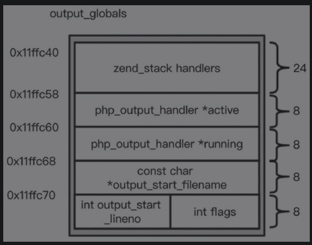

# cli模式的生命周期
```
static sapi_module_struct cli_sapi_module = {
	"cli",							/* 名字 */
	"Command Line Interface",    	/* 具体名字 */

	php_cli_startup,				/* 模块启动时调用的函数 */
	php_module_shutdown_wrapper,	/* 模块关闭时调用的函数 */
	NULL,							/* 激活需要调用的函数指针 */
	sapi_cli_deactivate,			/* deactivate */
	sapi_cli_ub_write,		    	/* unbuffered write */
	sapi_cli_flush,				    /* flush */
	NULL,							/* get uid */
	NULL,							/* getenv */
	php_error,						/* error handler */
	sapi_cli_header_handler,		/* header handler */
	sapi_cli_send_headers,			/* send headers handler */
	sapi_cli_send_header,			/* send header handler */
	NULL,				            /* read POST data */
	sapi_cli_read_cookies,          /* read Cookies */
	sapi_cli_register_variables,	/* register server variables */
	sapi_cli_log_message,			/* Log message */
	NULL,							/* Get request time */
	NULL,							/* Child terminate */
	STANDARD_SAPI_MODULE_PROPERTIES
};
```

## 模块初始化阶段
- startup->php_cli_startup->php_module_startup。
- php_module_startup的具体功能。

    1. 调用sapi_initialize_empty_request函数。对sapi_globals中的成员变量进行初始化。
    2. 调用sapi_activate函数。函数前半部分的主要工作还是初始化SG相关变量；函数的最后调用了sapi_module对应的activate方法和input_filter_init函数，对于不同运行模式可以自定义这些函数的实现。
    3. 调用php_output_startup函数。
        1. 对output_globals初始化后，分别对php_output_handler_aliases、php_output_handler_conflicts和php_output_handler_reverse_conflicts这3个HashTable进行初始化。
        
        2. 调用fwrite函数，输出字符串到stdout中。
        3. 调用php_startup_ticks函数，对PG(tick_functions)进行初始化，这里又出现一个宏定义，对应的是core_globals。
    4. gc_globals_ctor函数，对gc_globals进行初始化。
    5. 调用zend_startup函数。
        1. 调用start_memory_manager初始化内存管理。
        2. 调用virtual_cwd_startup初始化cwd_globals。

                typedef struct _virtual_cwd_globals {
	            cwd_state cwd;
	            zend_long  realpath_cache_size;
	            zend_long                   realpath_cache_size_limit;
	            zend_long                   realpath_cache_ttl;
	            realpath_cache_bucket *realpath_cache[1024];
                } virtual_cwd_globals;
        3. 调用zend_startup_extensions_mechanism启动扩展机制。
        4. 设置一些使用函数或者值。
        5. 设置词法和语法解析的入口函数compile_file以及执行的入口函数execute_ex。「PHP 7的“编译”入口是函数compile_file，这是词法和语法解析的入口；而对opcodes进行执行的入口是execute_ex函数。」
        6. 调用zend_init_opcodes_handlers方法，初始化Zend虚拟机的4597个handler。
        7. 对CG(function_table)、CG(class_table)、CG(auto_globals)以及EG(zend_constants)进行初始化。
        8. 调用ini_scanner_globals_ctor对ini_scanner_globals进行初始化。
        9. 调用php_scanner_globals_ctor对全局变量language_scanner_globals进行初始化，对应的宏是LANG_SCNG(v)。
    6. 调用zend_register_list_destructors_ex函数，注册析构函数list。
    7. 调用php_binary_init函数，获取PHP执行的二进制程序的路径。
    8. 调用php_output_register_constants函数，初始化输出相关的预定义常量。
    9. 调用php_rfc1867_register_constant注册文件上传相关的预定义常量。
    10. 调用php_init_config函数，会先读取php.ini文件，然后调用zend_parse_ini_file进行解析，并注册。
    11. 调用zend_register_standard_ini_entries函数，注册ini相关的变量。
    12. 调用php_startup_auto_globals函数，注册全局变量，如_GET/_POST等。
    13. 初始化SAPI对于不同类型内容的处理函数，对应函数为php_startup_sapi_content_types。
    14. 函数php_register_internal_extensions和php_register_extensions_bc分别为注册内部扩展和附加PHP扩展。
    15. zend_startup_extensions和zend_startup_modules启动扩展与模块。
    16. 对在php.ini中设置的禁用函数和禁用类进行设置，函数分别是php_disable_functions和php_disable_classes。

## 请求初始化阶段
函数入口为php_requet_startup

1. 调用php_output_activate函数，重置output_globals，初始化输出handler的栈，并把OG(flags)置为使用中。
2. 调用zend_activate函数。
    1. gc_reset函数初始化垃圾回收相关变量和函数。
    2. init_compile函数初始化编译器以及CG。
    3. init_executor函数初始化执行器以及EG。
    4. startup_scanner函数初始化扫描器以及SCNG。
    5. 调用sapi_activate函数，对SG进行初始化。
    6. 调用zend_signal_activate函数，对一些信号进行处理。
    7. 调用zend_activate_modules函数，回调各扩展的定义的request_startup钩子函数。

## 执行阶段
执行阶段的入口函数是php_execute_script，该函数会调用zend_execute_scripts，该函数通过调用compile_file对PHP代码进行词法和语法分析，生成AST，进而生成op_array。


## 请求关闭阶段
请求关闭阶段的入口函数为php_request_shutdown

1. 调用各模块中注册的关闭函数和析构函数。
2. 将输出缓冲器中的内容输出。
3. 调用所有扩展注册的钩子RSHUTDOWN函数。
4. 销毁request相关的全局变量，关闭编译器和执行器。
5. 还原ini配置。

## 模块关闭阶段
模块关闭阶段的入口函数为php_module_shutdown

1. 调用加载模块对应的flush函数，清理持久化符号表，销毁所有模块。
2. 关闭与php.ini配置文件解析相关的变量和函数。
3. 关闭内存管理和垃圾回收机制。
4. 关闭output输出相关的信息。
5. 销毁core_globals。

## 其他工作
