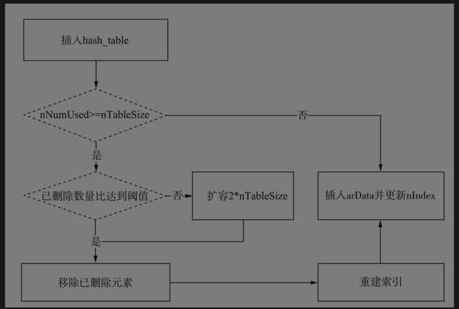

# 扩容和rehash操作
hash array在重置一个key时并不会真正触发删除操作，只做一个标识，删除是在扩容和重建索引时触发。

## 扩容

- hash array的容量分配是固定的，初始化时每次申请的是2n的容量，容量的最小值为23，最大值为0x80000000。
- 当容量足够时直接执行插入操作。
- 当容量不够时。
    - 达到阈值(ht->nNumUsed - ht->nNumOfElements > (ht->nNumOfElements >> 5)。则将已删除元素从HashTable中移除，并重建索引。
    - 如果未到阈值，则要进行扩容操作（见图5-34），新的容量扩大到当前大小的2倍（即2*nTableSize），将当前bucket数组复制到新的空间，然后重建索引。

## rehash
- rehash对应源码中的zend_hash_rehash(ht)方法。
- rehash的主要功能就是把HashTable bucket数组中标识为IS_UNDEF的数据剔除，把有效数据重新聚合到bucket数组并更新插入索引表。
- rehash不重新申请存内存，整个过程是在原有结构上做聚合调整。

具体步骤：
- 重置所有nIndex数组为-1；
- 初始化两个bucket类型的指针p、q，循环遍历bucket数组；
- 每次循环，p++，遇到第一个IS_UNDEF时，q=p；继续循环数组；
- 当再一次遇到一个正常数据时，把正常数据拷贝到q指向的位置，q++；
- 直到遍历完数组，更新nNumUsed等计数。