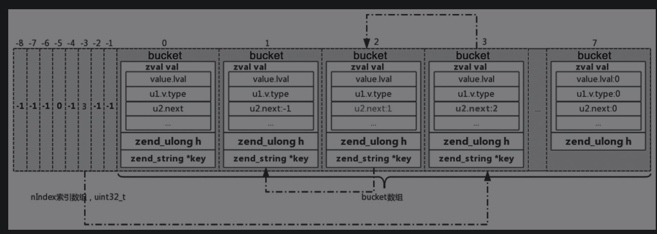

# 哈希冲突
数据在插入HashTable时，不同的key经过哈希函数得到的值可能相同，导致插入索引数组冲突，理论上需要在索引数组外再加一个链表把所有冲突的value以双链表的形式关联起来，然后读取的时候去遍历这个双链表中的数据，比较对应的key。

不单独维护一个双链表，而是把每个冲突的idx存储在bucket的zval.u2.next中，插入的时候把老的value存储的地址（idx）放到新value的next中，再把新value的存储地址更新到索引数组中。

第1、2、3个bucket发生哈希冲突。

- 插入第1个bucket，对应nIndex为-3，那么此时nIndex=-3的位置值为1。
- 若此时插入第2个bucket，与第1个冲突，也就是对应的nIndex也为-3。
    - 令nIndex=-3的位置值为2，同时将第2个bucket中zval里面的u2.next值置为1。
    - 在查找第1个bucket的key对应的nIndex时，找到第2个bucket，校验key值不同，会取u2.next对应的1，取第1个bucket中的内容，与key校验，一致，则返回。
- 若此时插入第3个bucket，与第1个和第2个冲突，那么用同样的方式，令nIndex=-3的位置值为3，同时将第3个bucket中zval里面的u2.next值置为2。

维护了一个隐形的链表，并用头插法插入新值。