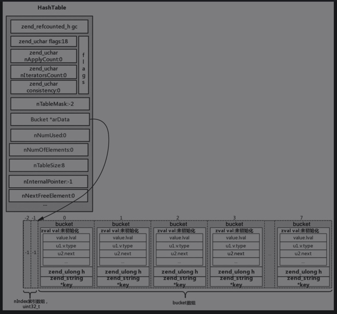
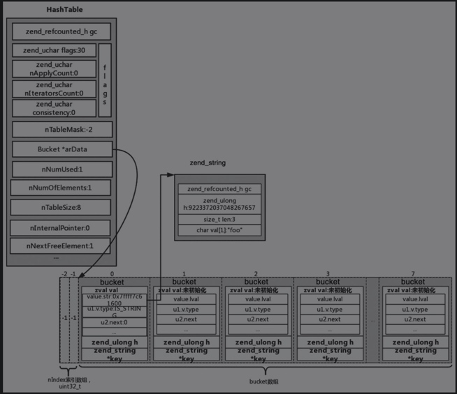
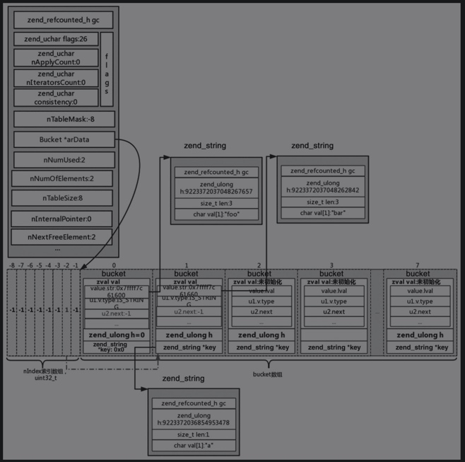
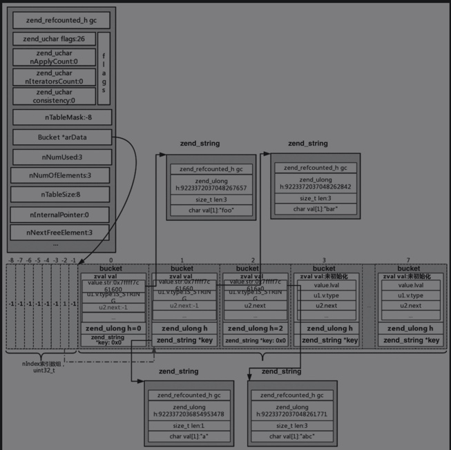
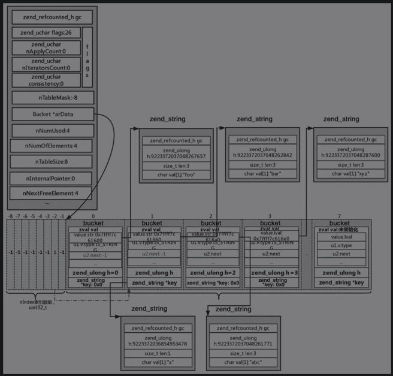
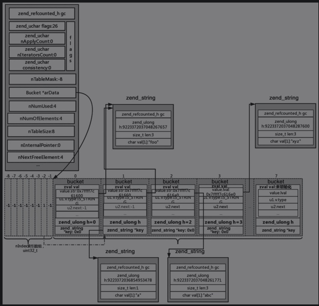
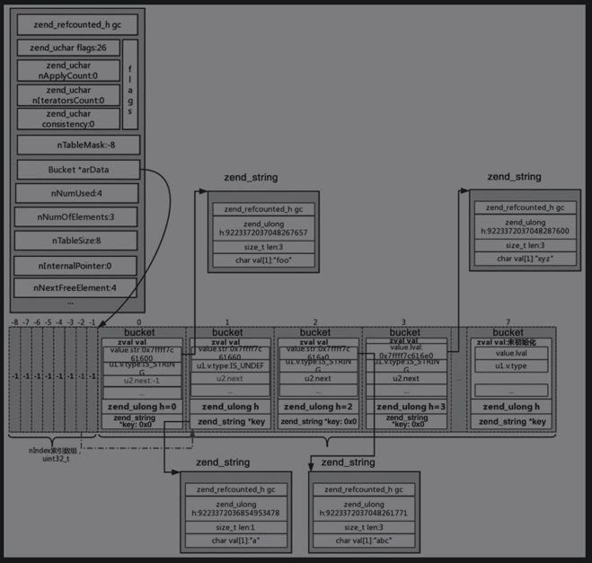

# 插入、更新、查找和删除
```
ZEND_API zval* ZEND_FASTCALL _zend_hash_add_or_update(HashTable *ht, zend_string *key, zval *pData, uint32_t flag ZEND_FILE_LINE_DC);
ZEND_API zval* ZEND_FASTCALL _zend_hash_update(HashTable *ht, zend_string *key,zval *pData ZEND_FILE_LINE_DC);
ZEND_API zval* ZEND_FASTCALL _zend_hash_update_ind(HashTable *ht, zend_string *key,zval *pData ZEND_FILE_LINE_DC);
ZEND_API zval* ZEND_FASTCALL _zend_hash_add(HashTable *ht, zend_string *key,zval *pData ZEND_FILE_LINE_DC);
ZEND_API zval* ZEND_FASTCALL _zend_hash_add_new(HashTable *ht, zend_string *key,zval *pData ZEND_FILE_LINE_DC);

ZEND_API zval* ZEND_FASTCALL _zend_hash_str_add_or_update(HashTable *ht, const char *key, size_t len, zval *pData, uint32_t flag ZEND_FILE_LINE_DC);
ZEND_API zval* ZEND_FASTCALL _zend_hash_str_update(HashTable *ht, const char *key, size_t len, zval *pData ZEND_FILE_LINE_DC);
ZEND_API zval* ZEND_FASTCALL _zend_hash_str_update_ind(HashTable *ht, const char *key, size_t len, zval *pData ZEND_FILE_LINE_DC);
ZEND_API zval* ZEND_FASTCALL _zend_hash_str_add(HashTable *ht, const char *key, size_t len, zval *pData ZEND_FILE_LINE_DC);
ZEND_API zval* ZEND_FASTCALL _zend_hash_str_add_new(HashTable *ht, const char *key, size_t len, zval *pData ZEND_FILE_LINE_DC);

ZEND_API zval* ZEND_FASTCALL _zend_hash_index_add_or_update(HashTable *ht, zend_ulong h, zval *pData, uint32_t flag ZEND_FILE_LINE_DC);
ZEND_API zval* ZEND_FASTCALL _zend_hash_index_add(HashTable *ht, zend_ulong h, zval *pData ZEND_FILE_LINE_DC);
ZEND_API zval* ZEND_FASTCALL _zend_hash_index_add_new(HashTable *ht, zend_ulong h, zval *pData ZEND_FILE_LINE_DC);
ZEND_API zval* ZEND_FASTCALL _zend_hash_index_update(HashTable *ht, zend_ulong h, zval *pData ZEND_FILE_LINE_DC);
ZEND_API zval* ZEND_FASTCALL _zend_hash_next_index_insert(HashTable *ht, zval *pData ZEND_FILE_LINE_DC);
ZEND_API zval* ZEND_FASTCALL _zend_hash_next_index_insert_new(HashTable *ht, zval *pData ZEND_FILE_LINE_DC);
```

- _zend_hash_xxx，用来插入或者更新字符串key，并且字符串key是指向zend_string的指针。
- _zend_hash_str_xxx，同样用来插入或者更新字符串key，不过字符串key是指向字符的指针，同时还需要一个len表示字符串的长度。
- _zend_hash_index_xxx，用来插入或者更新数字key。

## 操作详细

```
$arr[] = 'foo';         // packed array
$arr['a'] = 'bar';      // packed to hash
$arr[2] = 'abc';        // 自定义整数key
$arr[] = 'xyz';         // key取ht->nNextFreeElement
$arr['a'] = 'foo';      // 自定义整数key
echo $arr['a'];         // 查找
unset($arr['a']);       // 删除
```
- 执行zend_hash_init函数，对HashTable进行初始化。
    
- 调用_zend_hash_next_index_insert函数将uninitialized_zval插入到HashTable中，然后将字符串foo（zend_string类型）拷贝到对应的zval中。
    
- 对于$arr['a'] = 'bar'，首先调用zend_hash_find根据key='a’查找，查找不到对应的key，然后通过zend_hash_add_new把uninitialized_zval插入到HashTable中，此时因为之前是packed array，所以需要调用zend_hash_packed_to_hash进行转换。
    
    - ht->u.flags &= ～HASH_FLAG_PACKED = 26，生成一个新的arData，调用memcpy拷贝过去，然后释放掉老的arData。
    - 调用zend_hash_rehash进行rehash操作，生成的新的HashTable。
- 对于$arr[2] = 'abc';，首先使用_zend_hash_index_find函数根据h=2来查找，查找不到的话，调用zend_hash_index_add_new将其插入HashTable中去。
    
- 对于$arr[] = 'xyz'，调用_zend_hash_next_index_insert；对于h，使用的是ht->nNext-FreeElement，此ht->nNextFreeElement==3，同样传入h=3调用zend_hash_index_find_bucket查找，查找不到的话，进行插入。
    
- 对于$arr['a'] = 'foo'，首先调用zend_hash_find_bucket，通过key=a查找，通过zend_string_hash_val可以计算h= 9223372036854953478，然后计算出nIndex=h|ht->nTableMask,nIndex=-2，而-2位置对应1，找到arData的第1个位置，判断key是否等于’a'，然后将对应的值改为’foo'，并做优化，与第0个位置指向的zend_string是同一个位置，对应的内容是’foo'。
    
- 对于echo $arr['a'];，与数组查找类似。
- 对于unset($arr['a']);，调用zend_hash_del进行删除，首先通过key=a调用zend_string_hash_val(key)查找到结果为第1个bucket。
    
    - arData[-2]对应值改为-1, arData[1]对应的bucket的u1.v.type=IS_UNDF, nNumUsed并没有修改，还是为4，但是nNumOfElements减1，改为3。