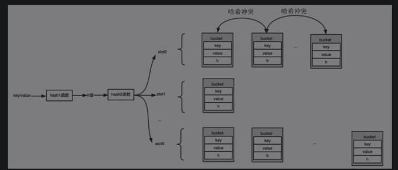

# 基本概念

## 语义
- PHP数组是一个字典，存储着键-值（key-value）对。通过键可以快速地找到对应的值，键可以是整型，也可以是字符串。
    - PHP使用HashTable来存储键-值对。
- PHP数组是有序的。这个有序指的是插入顺序，即遍历数组的时候，遍历元素的顺序应该和插入顺序一致，而不像普通字典一样是随机的。
    - 对HashTable进行了一些额外设计来保证有序。

## 概念
PHP的数组zend_array对应的是HashTable。HashTable是哈希表（也叫散列表）。

- key：键。通过它可以快速检索到对应的value。一般是数字或字符串。

- value：值。目标数据，可以是复杂的数据结构。
- bucket：桶。HashTable中存储数据的单元。用来存储key和value以及辅助信息的容器。
    - 增加h字段。
        - 由于HashTable中key可能是数字，也有可能是字符串，所以bucket在设计key的时候，需要做拆分，拆分成数字key和字符串key。
        - h值可以加快字符串key之间的比较速度。如果要比较两个字符串key1和key2是否相等，会首先比较key1和key2的h值是否相等，如果相等，再去比较字符串的长度以及内容。
- slot：槽。HashTable有多个槽，一个bucket必须从属于具体的某一个slot，一个slot下可以有多个bucket。
- 哈希函数：需要自己实现，在存储的时候，会对key应用哈希函数确定所在的slot。
    - 哈希函数拆分成了hash1和hash2函数。hash1将key映射为h值，hash2将h值映射为slot的索引值。
- 哈希冲突：当多个key经过哈希计算后，得出的slot的位置是同一个，那么就叫作哈希冲突。这时，一般有两种方法解决冲突——链地址法和开放地址法。PHP中采用的是链地址法，即将同一个slot中的bucket通过链表连接起来。