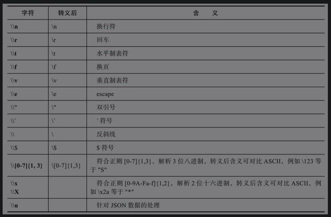
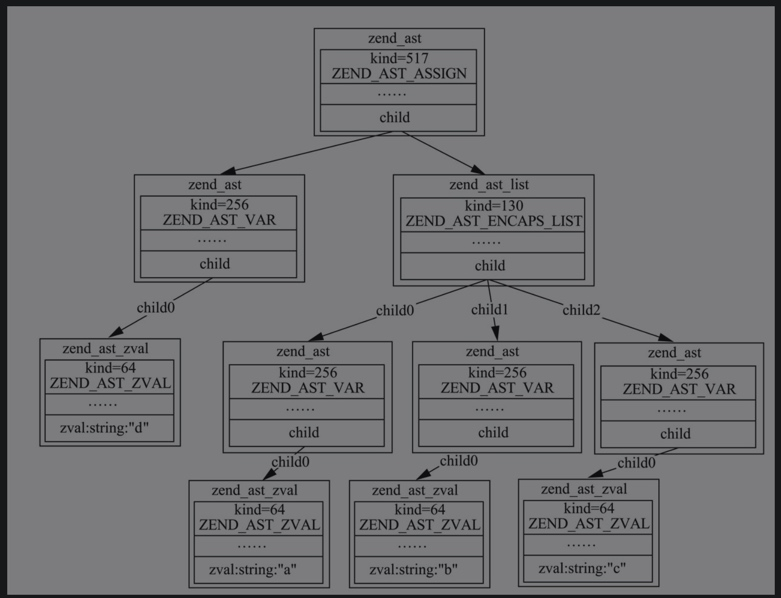

# 单引号与双引号
```
$a = "ab\0cd";
$b = 'ab\0cd';
strlen($a) = 5;
strlen($b) = 6;
```

## 转义对照表


## 双引号对变量的解析
```
$a = '1';
$b = ['2'];
$c = '3';
$d = "{$a}$b${c}";
$d = '1Array3';
```

遇到双引号里面出现变量时，词法解析器会生成一个ZEND_AST_ENCAPS_LIST类别的AST节点。为了让读者能更好地理解，这里画出了`$d ="{$a}$b${c}"`;
    

- 词法解析器根据正则匹配从代码中解析出token，语法解析器根据代码中的不同语法规则生成AST，其中就会用到token值。
- AST节点中kind标识AST类型，第一个节点kind=517实际对应的就是"="。
- kind=256对应的是变量的含义，kind=64对应的是实际字符值，kind=130对应的是ZEND_AST_ENCAPS_LIST节点。
- 解析AST调用的是zend_compile_top_stmt函数，zend_compile_top_stmt函数会根据AST解析出不同的opcode，存入opcodes数组，而双引号真正解析这些变量并组装成一个字符串的操作是在zend虚拟机逐行执行opcodes数组的阶段。

