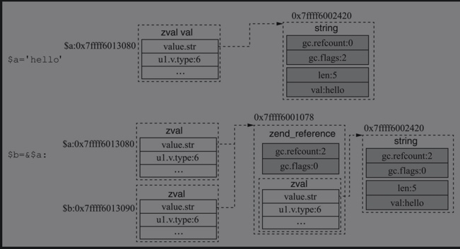

# 字符串的赋值与写时分离
- 常量字符串：PHP代码中硬编码的字符串，是在编译阶段初始化，最初存储在CG(active_op_array). Literals中（添加的同时也往CG(interned_strings)hash表写入），在执行阶段，经过oparray传递到execute_data.literals中存储。
- 临时字符串：计算出来的临时字符串，是执行阶段经zend虚拟机执行opcode对应方法计算所得到的字符串，存储在execute_data结构体中的临时变量区。

```
$a = 'hello';               /* hello为常量字符串 */
$b = 'time:' . time();      /* time:为常量字符串，'time:' . time()计算返回的字符串为临时字符串 */
```

## 字符串赋值操作中refcount的变化
一般认为，当字符串进行赋值操作时，对应字符串会refcount++，但实际情况却并不总是如此。

- 临时字符串的赋值

    ```
    $a = 'time:' . time(); 
    $b = $a;
    ```
    - 当字符串的值不是一个常量字符串时，每次赋值会执行字符串的refcount++。
    - 临时字符串的gc.flags被标识成0，此类字符串在请求结束后或refcount=0时会被销毁。
- 字符串常量的赋值

    ```
    $a = 'hello'; 
    $b = $a;
    ```
    - 赋值只修改zval中str的指针地址，两个字符串指向同一个str地址，但是refcount的值始终都是0。
    - 字符串的gc.flags会被标识成2。此类字符串只有在请求结束后才会被销毁（开启了opcache的例外，字符串存储在共享内存，不会被销毁）。
- 整型常量的赋值

    ```
    $a = 1;
    $b = $a;
    ```
    - 因为是int类型，没有refcount，会直接复制$a的值。

- 字符串引用赋值

    ```
    $a = 'hello'; 
    $b = &$a;
    ```
    
    - 引用赋值时，会多出zend_reference结构体，里面包含gc及zval字段，赋值时gc进行refcount++，字符串的引用赋值和其他类型引用赋值的实现方式都是一样的。

### 总结
1. 变量是简单类型（true/false/double/long/null）时直接拷贝值，不需要引用计数；
2. 变量是临时的字符串，在赋值时会用到引用计数，但如果变量是字符常量，则不会用到。
3. 变量是对象（zval.v.type=IS_OBJECT）、资源（zval.v.type=IS_RESOURCE）、引用（zval.v.type=IS_REFERENCE，即`$a=&$b`）类型时，赋值一定会用到引用计数；
4. 变量是普通的数组，赋值时也会用到引用计数，变量是IS_ARRAY_IMMUTABLE时，赋值不使用引用计数。

## 字符串的写时分离
- 当字符串的refcount>1时，也就是有多个变量引用同一块内存值，对其中一个变量的值进行修改，会触发写时分离，此机制的好处就是，保证了各变量间的独立性。
- 只有zval为string、array、resource时，才会有写时分离，对象、传址引用等不支持。