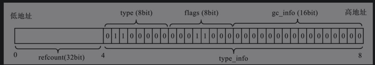
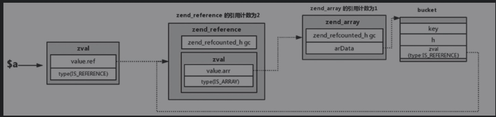

# 垃圾回收
复杂类型的引用计数都维护在各个结构体头部的gc中，gc的作用就是支持垃圾回收。

## GC基本结构



```
typedef struct _zend_refcounted_h {
	uint32_t         refcount;			/* reference counter 32-bit */
	union {
		struct {
			ZEND_ENDIAN_LOHI_3(
				zend_uchar    type,     /* 当前元素的数据类型 */
				zend_uchar    flags,    /* 标记字符短或对象类型 */
				uint16_t      gc_info)  /* 记录所在gc池的位置和颜色 */
		} v;
		uint32_t type_info;
	} u;
} zend_refcounted_h
```

- type：记录当前元素的类型，冗余zval.u1.v.type。
- flags：第二个字节用来标记数据类型，可以是字符串类型或数组类型等。
    - 字符串标记
    
    ```
    IS_STR_PERSISTENT           (1<<0) // 是malloc分配内存的字符串
    IS_STR_INTERNED             (1<<1) // 保留字符串
    IS_STR_PERMANENT        	(1<<2) // 不可变的字符串，起哨兵作用。
    IS_STR_CONSTANT             (1<<3) // 代表常量的字符串
    IS_STR_CONSTANT_UNQUALIFIED (1<<4) // 带有可能命名空间的常量字符串
    ```
    
    - 数组标记

    ```
    IS_ARRAY_IMMUTABLE			(1<<1) /* 不可变的数组 */
    ```
    
    - 对象标记

    ```
    IS_OBJ_APPLY_COUNT			0x07
    IS_OBJ_DESTRUCTOR_CALLED	(1<<3)
    IS_OBJ_FREE_CALLED			(1<<4)
    IS_OBJ_USE_GUARDS           (1<<5)
    IS_OBJ_HAS_GUARDS           (1<<6)
    ```
    
- gc_info：占type_info的后两个字节，标记当前元素的颜色和垃圾回收池中的位置。
    - 其中高两位标记颜色。

    ```
    GC_COLOR  0xc000
    GC_BLACK  0x0000
    GC_WHITE  0x8000
    GC_GREY   0x4000
    GC_PURPLE 0xc000
    ```
    
## 引用计数
有gc的变量在引用时，gc.recount会加1。
发现引用计数为0，会调用ZVAL_UNDEF(var)

## 循环引用
```
$a = [];
$a[] = &%a;
```

- 在PHP 7中使用“&”会改变等号两边zval的类型（改为IS_REFERENCE）。
- $a所在的zval类型被标记为IS_UNDEF, zend_reference结构体的引用计数减1，但仍然大于0，这时候，后面的结构可能会成为垃圾。
- 对此不处理可能会造成内存泄露。

## 垃圾回收

### 垃圾收集器
```
typedef struct _zend_gc_globals {
	zend_bool         gc_enabled;
	zend_bool         gc_active;
	zend_bool         gc_full;

	gc_root_buffer   *buf;				/* 预先分配的缓冲区数组  */
	gc_root_buffer    roots;			/* 指向缓冲区中最新加入的可能是垃圾的数组 */
	gc_root_buffer   *unused;			/* 未使用的缓冲区列表           */
	gc_root_buffer   *first_unused;		/* 指向第一个未使用的缓冲区列表   */
	gc_root_buffer   *last_unused;		/* 指向最后一个未使用的缓冲区列表    */

	gc_root_buffer    to_free;			/* 待释放的列表 */
	gc_root_buffer   *next_to_free; /* 下一个待释放的列表 */

	uint32_t gc_runs;
	uint32_t collected;

#if GC_BENCH
	uint32_t root_buf_length;
	uint32_t root_buf_peak;
	uint32_t zval_possible_root;
	uint32_t zval_buffered;
	uint32_t zval_remove_from_buffer;
	uint32_t zval_marked_grey;
#endif

} zend_gc_globals;
```

```
typedef struct _gc_root_buffer {
	zend_refcounted          *ref;
	struct _gc_root_buffer   *next;     /* 双向链表 */
	struct _gc_root_buffer   *prev;
	uint32_t                 refcount;
} gc_root_buffer;
```

- zend_gc_globals
    - gc_enabled：是否开启gc。
    - gc_active：垃圾回收算法是否运行。
    - gc_full：垃圾缓冲区是否满了，在debug模式下有用。
    - buf：垃圾缓冲区，PHP 7默认大小为10000个节点位置，第0个位置保留，即不会使用，定义在zend/zend_gc.c文件中。

        ```
        GC_ROOT_BUFFER_MAX_ENTRIES 10001
        ```
    - roots：指向缓冲区中最新加入的可能是垃圾的元素。
    - unused：指向缓冲区中没有使用的位置，在没有启动垃圾回收算法前，指向空。
    - first_unused：指向缓冲区中第一个未使用的位置，新的元素插入缓冲区后，指针会向后移动一位。
    - last_unused：指向缓冲区中最后一个位置。
    - to_free：待释放的列表。
    - next_to_free：下一个待释放的列表。
    - gc_runs：记录gc算法运行的次数，当缓冲区满了，才会运行gc算法。
    - collected：记录gc算法回收的垃圾数。

### GC初始化
```
ZEND_API void gc_init(void)
{
	if (GC_G(buf) == NULL && GC_G(gc_enabled)) {
		GC_G(buf) = (gc_root_buffer*) malloc(sizeof(gc_root_buffer) * GC_ROOT_BUFFER_MAX_ENTRIES);
		GC_G(last_unused) = &GC_G(buf)[GC_ROOT_BUFFER_MAX_ENTRIES];
		gc_reset();
	}
}
```

- unset操作后引用计数大于0才会进入gc的列表中。
- 当有新的可能是垃圾的元素被记录，元素被插入到缓冲区的第一个位置，同时roots指向第一个位置，first_unused向后移动一个gc_root_buffer的大小，roots指向缓冲区中最新插入的可能是垃圾的元素位置。
- 进行unset操作的时候，如果当前的refcount大于0会插入到缓冲区的第1个位置。（头插法）

### 垃圾收集的过程
1. 要求数据类型是数组和对象；
2. 没有在缓冲区中存在过；
3. 没有被标记过；
4. 将其gc_info标记为紫色，且记录其在缓冲区的位置。
5. 当缓冲区满了，再收集到新的元素就会触发垃圾回收算法。

### 垃圾回收算法
1. 对roots环中每个元素进行深度优先遍历，将每个元素中gc_info为紫色的标记元素为灰色，且引用计数减1。
2. 扫描roots环中gc_info为灰色的元素，如果发现其引用计数仍旧大于0，说明这个元素还在其他地方使用，那么将其颜色重新标记会黑色，并将其引用计数加1（在第一步有减1操作）。如果发现其引用计数为0，则将其标记为白色。该过程同样为深度优先遍历。
3. 扫描roots环，将gc_info颜色为黑色的元素从roots移除。然后对roots中颜色为白色的元素进行深度优先遍历，将其引用计数加1（在第一步有减1操作），然后将roots链表移动到待释放的列表中（to_free）。
4. 释放to_free列表的元素。