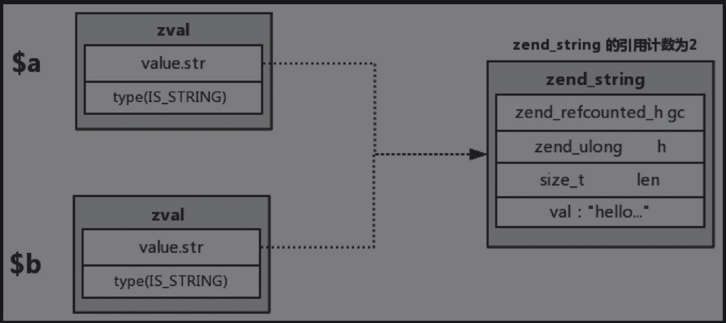
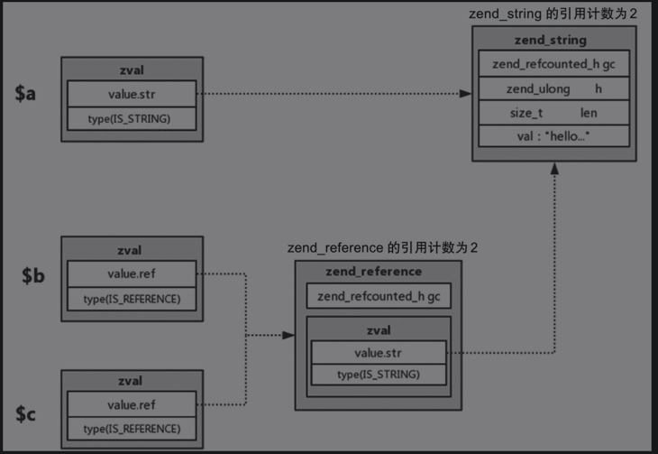

# 变量类型

```
/* 常规数据类型 */
#define IS_UNDEF					0      // 标记未使用类型
#define IS_NULL						1      // NULL
#define IS_FALSE					2      
#define IS_TRUE						3
#define IS_LONG						4      // 长整型
#define IS_DOUBLE					5      // 浮点型
#define IS_STRING					6      // 字符串
#define IS_ARRAY					7      // 数组
#define IS_OBJECT					8      // 对象
#define IS_RESOURCE					9      // 资源 
#define IS_REFERENCE				10     // 参考类型（内部使用）

/* 常量类型 */
#define IS_CONSTANT					11     // 常量类型
#define IS_CONSTANT_AST				12     // 常量类型AST树

/* 伪类型 */
#define _IS_BOOL					13
#define IS_CALLABLE					14
#define IS_ITERABLE					19
#define IS_VOID						18

/* 内部类型 */
#define IS_INDIRECT             	15     // 间接类型
#define IS_PTR						17     // 指针类型
#define _IS_ERROR					20     // 错误类型
```

- IS_UNDEF：表示数据可以被覆盖或者删除。对数组元素unset操作时，先将该元素所在的Bucket的位置标记为IS_UNDEF，当HashTable中IS_UNDEF元素个数到达一定阈值时，进行rehash操作时再将IS_UNDEF标记的元素覆盖或删除。
- IS_TRUE和IS_FALSE：优化类型的检查，不需要再做一次类型判断。
- IS_REFERENCE：是新增的类型，PHP 7中使用不同的处理方式来处理“&”。
- IS_INDIRECT：同样也是新增的类型，由于PHP 7中HashTable的设计跟PHP 5中有很大的不同，所以在解决全局符号表访问CV变量表的问题上，引入了IS_INDRECT类型。
- IS_PTR：该类型被定义为指针类型，用来解析value.ptr，通常用在函数类型上。比如声明一个函数或者方法。
- _IS_ERROR：为新增的错误类型，校验zval的类型是否合法。

## 整型和浮点型
```
$a = 10;
$b = $a;
$a = 20;
unset($a);
```
- 生成一个zvalA，u1.v.type = IS_LONG, value.lval = 10。
- 在生成一个zvalB，u1.v.type = IS_LONG, value.lval = 10。
- 修改zvalA的value.lval为20。
- 修改zvalA的u1.v.type为IS_UNDEF。

## 字符串类型
```
struct _zend_string {
	zend_refcounted_h gc;
	zend_ulong        h;                /* hash值 */
	size_t            len;
	char              val[1];
};
```
- hash值提升了php的50%性能。避免了数组中hash值的重复计算。
- len表示字符串的长度。
- val记录了字符串内容。
- zend_refcounted_h：记录GC信息。

## 数组
```
struct _zend_array {
	zend_refcounted_h gc;
	union {
		struct {
			ZEND_ENDIAN_LOHI_4(
				zend_uchar    flags,
				zend_uchar    nApplyCount,
				zend_uchar    nIteratorsCount,
				zend_uchar    consistency)
		} v;
		uint32_t flags;
	} u;
	uint32_t          nTableMask;
	Bucket           *arData;
	uint32_t          nNumUsed;
	uint32_t          nNumOfElements;
	uint32_t          nTableSize;
	uint32_t          nInternalPointer;
	zend_long         nNextFreeElement;
	dtor_func_t       pDestructor;
};
```
- PHP将字符串key通过hash函数运算返回一个整数，这个整数作为「普通」数组的索引。

## 引用
```
struct _zend_resource {
	zend_refcounted_h gc;
	int               handle; // TODO: may be removed ???
	int               type;
	void              *ptr;
};
```

```
$a = 'hello' . time();
$b = $a;
$c = &$b;
```




## 间接zval

## 常量和常量AST

### 常量
```
$a = "hello";
```
- a，和hello就是常量，其zval.u1.v.type_flags 标记为可引用和可复制。

### 常量AST
```
struct _zend_ast_ref {
	zend_refcounted_h gc;
	zend_ast         *ast;
};
```

## 资源类型
```
struct _zend_resource {
	zend_refcounted_h gc;
	int               handle; // TODO: may be removed ???
	int               type;
	void              *ptr;
};
```
文件句柄、Socket链接等是资源类型，通过void * 指针可以指向任何结构体。

## 对象
```
struct _zend_object {
	zend_refcounted_h gc;
	uint32_t          handle; // TODO: may be removed ???
	zend_class_entry *ce;
	const zend_object_handlers *handlers;
	HashTable        *properties;
	zval              properties_table[1];
};
```
- 对象的属性数据存储在properties_table数组中。key为对象的属性名，value为属性值在properties_table数组中的偏移量。
- 通过偏移量可以在properties_table数组中取到真正的数据。