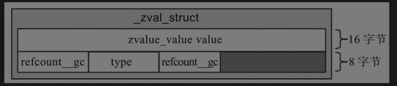
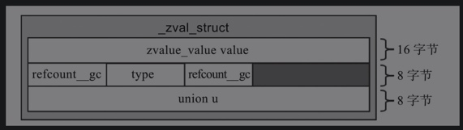
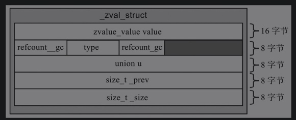

# zval

## PHP5

### 结构体类型
```
typedef  union _zvalue_value {
    long lval;
    double dval;
    struct {
        char *val;
        int len;
    } str;
    HashTable *ht;
    zend_object_value obj;
    zend_ast *ast;
} zvalue_value;

struct _zval_struct {
    zvalue_value value;             /* value值 */
    zend_unit refcount_gc;
    zend_uchar type;                /* 类型 */
    zend_uchar is_ref_gc;
};

```


- zvalue_value结构体
    - lval和dval大小为8字节，
    - str结构体大小为12字节，
    - ht和ast是指针类型，大小为8字节，
    - obj结构体大小为12字节。
    - 对齐后，value的字节数为16字节。
- refcount_gc大小为4字节
- type、is_ref__gc大小为1个字节。
- 总共应该是32个字节呀。

### 循环引用
对zval结构体进行了扩充。
增加了个共用体指针。占8个内存。

因为整型和浮点型不需要gc，所以造成内存浪费。

### 内存池


## PHP7

### 结构体类型
```
typedef union _zend_value {
	zend_long         lval;				/* 整型 */
	double            dval;				/* 浮点型 */
	zend_refcounted  *counted;          /* 引用计数 */
	zend_string      *str;              /* 字符串类型 */
	zend_array       *arr;              /* 数组类型 */
	zend_object      *obj;              /* 对象类型 */
	zend_resource    *res;              /* 资源类型 */
	zend_reference   *ref;              /* 引用类型 */
	zend_ast_ref     *ast;              /* 抽象语法树 */
	zval             *zv;               /* zval类型 */
	void             *ptr;              /* 指针类型，8字节 */
	zend_class_entry *ce;               /* class类型 */
	zend_function    *func;             /* function类型 */
	struct {
		uint32_t w1;
		uint32_t w2;
	} ww;
} zend_value;

struct _zval_struct {
	zend_value        value;			/* value */
	union {
		struct {
			ZEND_ENDIAN_LOHI_4(
				zend_uchar    type,			/* zval类型 */
				zend_uchar    type_flags,
				zend_uchar    const_flags,
				zend_uchar    reserved)	    /* call info for EX(This) */
		} v;
		uint32_t type_info;
	} u1;
	union {
		uint32_t     next;                 /* 解决hash冲突 */
		uint32_t     cache_slot;           /* 运行时缓存 */
		uint32_t     lineno;               /* 为ask存行号 */
		uint32_t     num_args;             /* EX(This)参数个数 */
		uint32_t     fe_pos;               /* foreach 的位置 */
		uint32_t     fe_iter_idx;          /* foreach 游标的标记 */
		uint32_t     access_flags;         /* class 的常量访问标识 */
		uint32_t     property_guard;       /* 单一属性保护 */
	} u2;
};
```

#### u1的字段含义
- type：记录变量类型。
- type_flag：对应变量类型特有的标记，不同类型的变量对应的flag也不同。
    
    ```
    /* zval.u1.v.type_flags */
    #define IS_TYPE_CONSTANT			(1<<0) // 常量类型
    #define IS_TYPE_IMMUTABLE			(1<<1) // 不可变的类型，存在共享内存中的数组
    #define IS_TYPE_REFCOUNTED			(1<<2) // 需要引用计数的类型
    #define IS_TYPE_COLLECTABLE			(1<<3) // 可能包含循环引用的类型。
    #define IS_TYPE_COPYABLE			(1<<4) // 可被复制的类型
    ```
- const_flag：常量类型的标记，对应的属性有

    ```
    /* zval.u1.v.const_flags */
    #define IS_CONSTANT_UNQUALIFIED		0x010
    #define IS_CONSTANT_VISITED_MARK	0x020
    #define IS_CONSTANT_CLASS           0x080  /* __CLASS__ in trait */
    #define IS_CONSTANT_IN_NAMESPACE	0x100  /* used only in opline->extended_value */
    ```
- reserved 保留字段
- type_info 为前4个字段的组合，可以修改任意值。

#### u2
uint32_t 占4个字节
- next：用于解决hash冲突问题。
- cache_slot：运行时缓存。在执行函数时会优先去缓存中查找，若缓存中没有，会在全局的function表中查找。
- lineno：文件执行的行号，应用在AST节点上。
- num_args：函数调用时传入参数的个数。
- fe_pos：遍历数组时的当前位置。比如在对数组执行foreach时，fe_pos每执行一次都会加1。当再次调用foreach对数组遍历时，会首先对数组的fe_pos指针重置。
- fe_iter_idx：跟fe_pos用途类似，只是这个字段是针对对象的。
- access_flags：对象类的访问标志，常用的标识有public、protected、private。
- property_guard：防止类中魔术方法的循环调用，比如__get、__set等。

### 内存申请
临时变量直接在栈中申请。

### 取值
- 根据不同的type值取value中对应的不同值。
- 以u1.v.type值为IS_ARRAY为例，那么取value.arr的值，对应zend_array。
- 同样，如果u1.v.type值为IS_LONG，通过value. lval取值。
