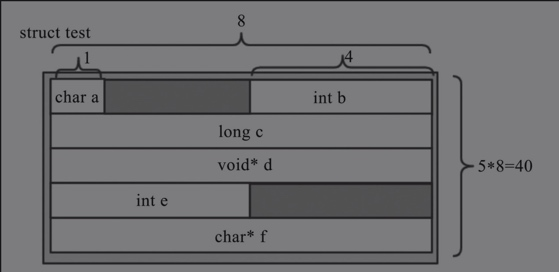
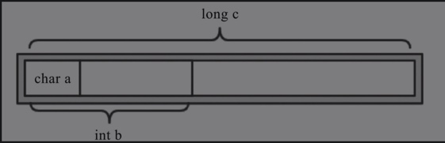
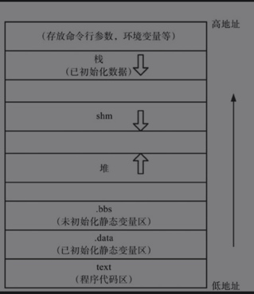

# 基础

## 结构体与联合体
- 结构体存在内存对齐。
    1. 第一个成员在与结构体变量偏移量为0的地址处。
    2. 其他成员变量要对齐到某个数字（对齐数）的整数倍的地址处。
        对齐数 = 编译器默认的一个对齐数 与 该成员大小的较小值。
        VS中默认的值为8， Linux中的默认值为4
    3. 结构体总大小为最大对齐数（每个成员变量都有一个对齐数）的整数倍。
    4. 如果嵌套了结构体的情况，嵌套的结构体对齐到自己的最大对齐数的整数倍处，结构体的整体大小就是所有最大对齐数（含嵌套结构体的对齐数）的整数倍。

- 联合体为内存共用。结构体中各元素的开始位置的字节编号是一致的。修改其中任意一个元素均会影响其他元素。

## 堆和栈

- 栈区（stack）——存储参数值、局部变量，维护函数调用关系等。
- 堆区（heap）——动态内存区域，随时申请和释放，程序自身要对内存泄漏负责。
- 全局区（静态区）——存储全局和静态变量。
- 字面量区——常量字符串存储区。
- 程序代码区——存储二进制代码。

1. 栈上的变量是局部的，随着局部空间的销毁而销毁，由系统负责。
2. 堆上的变量可以提供全局访问，需要自行处理其生命周期。