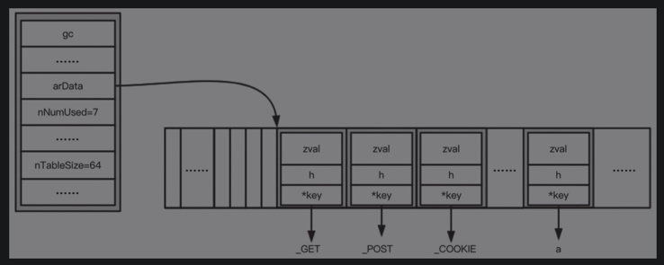

# 相关数据结构

## EG(v)
- 全局变量executor_globals
- 维护了符号表（symbol_table、function_table、class_table等）、执行栈（zend_vm_stack）以及包含执行指令的zend_execute_data，另外还包含了include的文件列表、autoload函数、异常处理handler等重要信息
- 结构体是_zend_executor_globals

```
struct _zend_executor_globals {
	zval uninitialized_zval;
	zval error_zval;

	/* symbol table cache */
	zend_array *symtable_cache[SYMTABLE_CACHE_SIZE];
	zend_array **symtable_cache_limit;
	zend_array **symtable_cache_ptr;

	zend_array symbol_table;		/* main symbol table */

	HashTable included_files;	/* files already included */

	JMP_BUF *bailout;

	int error_reporting;
	int exit_status;

	HashTable *function_table;	/* function symbol table */
	HashTable *class_table;		/* class table */
	HashTable *zend_constants;	/* constants table */

	zval          *vm_stack_top;
	zval          *vm_stack_end;
	zend_vm_stack  vm_stack;

	struct _zend_execute_data *current_execute_data;
	zend_class_entry *fake_scope; /* used to avoid checks accessing properties */

	zend_long precision;

	int ticks_count;

	HashTable *in_autoload;
	zend_function *autoload_func;
	zend_bool full_tables_cleanup;

	/* for extended information support */
	zend_bool no_extensions;

	zend_bool vm_interrupt;
	zend_bool timed_out;
	zend_long hard_timeout;

#ifdef ZEND_WIN32
	OSVERSIONINFOEX windows_version_info;
#endif

	HashTable regular_list;
	HashTable persistent_list;

	int user_error_handler_error_reporting;
	zval user_error_handler;
	zval user_exception_handler;
	zend_stack user_error_handlers_error_reporting;
	zend_stack user_error_handlers;
	zend_stack user_exception_handlers;

	zend_error_handling_t  error_handling;
	zend_class_entry      *exception_class;

	/* timeout support */
	zend_long timeout_seconds;

	int lambda_count;

	HashTable *ini_directives;
	HashTable *modified_ini_directives;
	zend_ini_entry *error_reporting_ini_entry;

	zend_objects_store objects_store;
	zend_object *exception, *prev_exception;
	const zend_op *opline_before_exception;
	zend_op exception_op[3];

	struct _zend_module_entry *current_module;

	zend_bool active;
	zend_bool valid_symbol_table;

	zend_long assertions;

	uint32_t           ht_iterators_count;     /* number of allocatd slots */
	uint32_t           ht_iterators_used;      /* number of used slots */
	HashTableIterator *ht_iterators;
	HashTableIterator  ht_iterators_slots[16];

	void *saved_fpu_cw_ptr;
#if XPFPA_HAVE_CW
	XPFPA_CW_DATATYPE saved_fpu_cw;
#endif

	zend_function trampoline;
	zend_op       call_trampoline_op;

	void *reserved[ZEND_MAX_RESERVED_RESOURCES];
}
```

- symbol_table：符号表，主要存放全局变量，以及一些魔术变量，如`$_GET`、`$_POST`等。
- function_table：函数表，主要存放函数，包括大量的内部函数以及用户自定义的函数，如zend_version、func_num_args、str系列函数等。
- class_table：类表，主要存放内置的类以及用户自定义的类，如stdclass、throwable、exception等类。
- zend_constants：常量表，存放PHP中的常量，如E_ERROR、E_WARNING等。
- vm_stack：虚拟机的栈，执行时压栈、出栈都在这里操作。
- current_execute_data：对应_zend_execute_data结构体，存放执行时的数据。

## 符号表
符号表分为symbol_table、function_table和class_table等。

- symbol_table：symbol_table用于存放变量信息，其类型是HashTable。

- function_table：function_table对应的是函数表，其类型也是HashTable。
    - 函数表中有大量的函数，有848个之多，这里面主要是内部函数，如zend_version、func_num_args、cli_get_process_title等。

- class_table：class_table对应的是类表，其也是HashTable。


