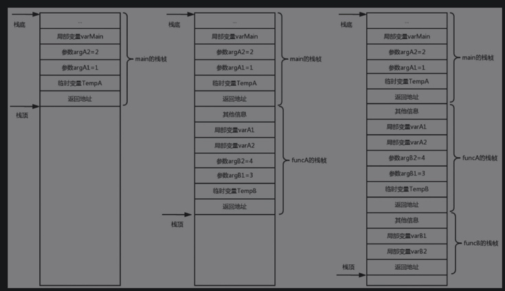

# 基础知识
Zend虚拟机（称为Zend VM）是PHP语言的核心，承担了语法和词法分析、AST编译以及指令的执行工作。

## 虚拟机架构


- 解释层：主要负责对PHP代码进行词法和语法分析，生成对应的AST；另一个工作就是对AST进行编译，生成符号表和指令集。
- 中间数据层：主要包含了虚拟机的核心部分——执行栈的维护、指令集和符号表的存储，而这些是执行引擎调度执行的基础。
- 执行层：执行指令集的引擎，负责最终的执行并生成结果，这一层实现了大量的底层函数。

## 符号表
- 符号表是编译程序在编译过程中用来记录源程序中各种名字的特性信息，所以也称为名字特性表。
- 名字一般包含程序名、过程名、函数名、用户定义类型名、变量名、常量名、枚举值名、标号名等。
- 特性信息指的是名字的种类、类型、维数、参数个数、数值及目标地址（存储单元地址）等。


符号表一般有3种构造和处理方法，分别是线性查找、二叉树和Hash技术。
- 线性查找法是最简单的，按照符号出现的顺序填表，每次查找从第一个位置开始顺序查找，效率比较低；
- 二叉树实现了对半查找，在一定程度上提高了效率；
- 效率最高的方法是通过Hash技术实现符号表，PHP 7中的符号表就是使用HashTable实现的。

## 函数调用栈

```
int funcB(int argB1, int argB2) {
    int varB1, varB2;
    return argB1 + argB2;
}
int funcA(int argA1, int argA2) {
    int varA1, varA2;
    return argA1 + argA2 + funcB(3, 4);
}
int main() {
    int varMain;
    return funcA(1, 2);
}
```
压栈：

出栈：


## 指令
汇编语句中的指令语句格式一般如下：
[标号:] [前缀] 指令助记符 [操作数] [;注释]
- 标号字段由各种有效字符组成，一般表示符号地址，具有段基址、偏移量、类型3种属性。通常情况下，这部分是可选部分，主要为便于程序的读写而使用。
- 指令助记符规定指令或伪指令的操作功能，是语句中唯一不可缺少的部分。
- 操作数指明指令语句中提供给指令的操作对象、存放位置。操作数可以是1个、2个或0个，2个操作数之间用逗号“, ”分开。
- 注释以“ ; ”开始，用于对程序进行解释和说明。