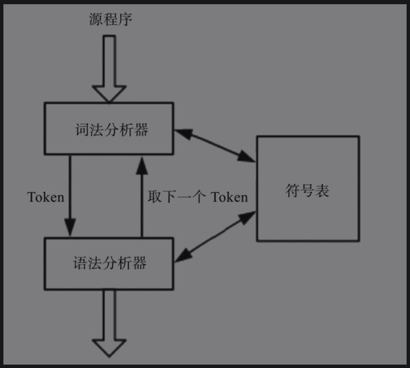
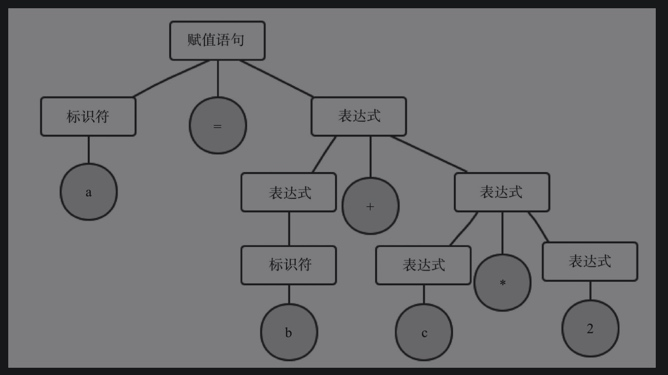

# 基础知识

## 编译器
编译器是一个程序，是可以读取某种语言（称作源语言）编写的程序并将其翻译成一个与之等价的另一种语言（称作目标语言）的程序。

## 源程序分析
整个语言处理过程需要几个程序，分别是预处理器、编译器、汇编器以及装载器/连接器。

- 预处理器程序会把存储在不同文件中的程序模块集成为一个完整的源程序；
- 编译器会把源程序编译为目标汇编程序；
- 而汇编器会继续将目标汇编程序转换为可重定位的机器码；
- 然后经过装载器和连接器转为绝对的机器代码。

## 词法分析
又叫线性分析，从左到右读取源程序的字符，并将字符转换为一个又一个的记号，称作Token。

```
a = b + c * 2
```
词法分析将其分成如下几部分，表达式的空格会删掉：
- Token a；
- 赋值符号=；
- Token b；
- 加号+；
- Token c；
- 乘号*；
- 数字2。

词法分析是编译的第一个阶段，主要任务是读取源程序，生成Token，提交给语法分析器使用。
词法分析器收到语法分析器发出的“取下一个Token”的命令时，词法分析器继续读入源程序的字符，直到识别出下一个Token。



## 语法分析
这个过程会把字符串或者Token在层次上划分为有一定层次的组，每个组有整体的含义。

```
a = b + c * 2
```

- 任何一个标识符都是表达式。
- 任何一个数字（包括a\b\c\2）都是表达式。
- 如果exp1和exp2是表达式，则exp1+exp2、exp1*exp2、{epx1}也是表达式。

## BNF范式
- ::=表示定义。
- “ ”双引号里的内容表示字符。
- <>尖括号里的内容表示语法单位。
- | 竖线两边的是可选内容，相当于or。
