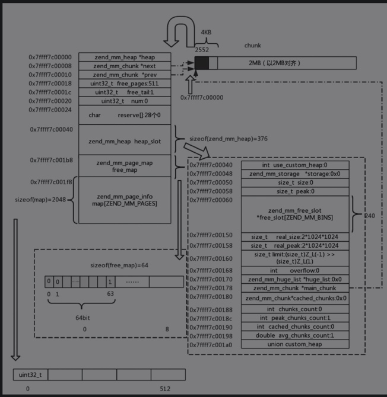
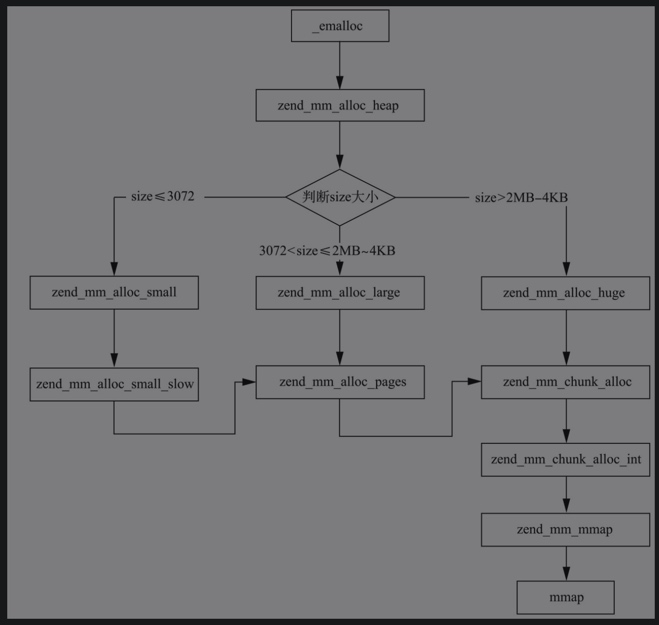

# 内存管理的详细实现
SAPI调用php_module_startup时，
会调用start_memory_manager，
继而调用alloc_globals_ctor，
然后调用MM的初始化函数zend_mm_init

## 内存管理初始化
- 首先，申请一个chunk，其大小是2MB，将其初始化。
- 然后，使用该chunk的第0个page存放zend_mm_chunk，以管理整个chunk，同时将AG的mm_heap放在heap_slot中，因此整个zend_mm_chunk会占2552B。
- 接着，将chunk中的heap_slot地址赋值给alloc_globals.mm_heap，对alloc_globals.mm_heap进行初始化：main_chunk置为刚申请的chunk,cached_chunks初始化为NULL, chunks_count初始化为1, peak_chunks_count初始化为1, cached_chunks_count初始化为0, avg_chunks_count初始化为1.0,real_size初始化为2MB, size和peak均初始化为0。



## 内存申请
```
#define emalloc(size)						_emalloc((size) ZEND_FILE_LINE_CC ZEND_FILE_LINE_EMPTY_CC)
#define emalloc_large(size)					_emalloc_large((size) ZEND_FILE_LINE_CC ZEND_FILE_LINE_EMPTY_CC)
#define emalloc_huge(size)					_emalloc_huge((size) ZEND_FILE_LINE_CC ZEND_FILE_LINE_EMPTY_CC)
```

1. 根据申请内存的size大小，若size>（2MB-4KB），定义为huge内存的分配，调用chunk的分配函数，chunk直接调用mmap向操作系统申请。
2. 如果size>3072且size≤（2MB-4KB），定义为large内存的分配，分配n×Page，也就是4KB的整数倍，其中n× Page是大于size的最小的Page的整数倍。large类型内存在mm_heap中的chunk上分配。
3. 如果size<3072，定义为small内存的分配，PHP 7从8B到3KB建立了30个规格，申请者申请size大小的内存时，MM会找到大于等于size的最小的规格，比如申请14B，会返回16B，在16B的规格中找到可以使用的内存返回；如果找不到，则申请对应规格的内存，并不是只申请一个，而是多申请一些，挂载到mm_heap的free_slot中，方便下次申请时直接返回。

## 内存管理之huge内存
