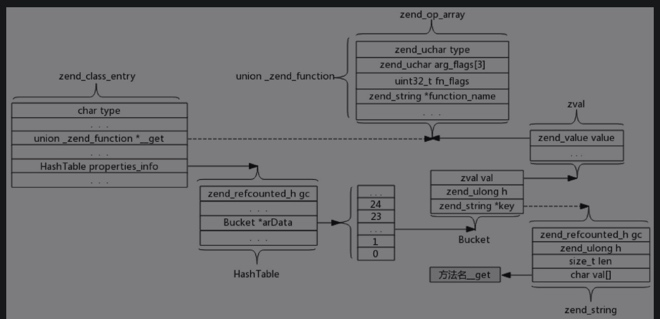

# 其他特性

## 魔术方法
魔术方法是PHP独有的特性。魔术方法的实现方式与一般的方法几乎无异。区别就是部分魔术方法不只存在于zend_class_entry中的function_table，在zend_class_entry中也会直接存一份。

## 自动加载
- 自动加载是依据用户实现的规则来加载PHP文件，实现类的加载。
- 当用到一个类时，如果在EG(class_table)中没有找到这个类，则去调用用户实现的自动加载方法。调用后到EG(class_table)中查找此类，如果此时仍然没有，则抛出语法错误。

### __autoload()
这个自动加载方法比较简单，在PHP中实现了此方法后，会存储在EG(autoload_func)中。当需要加载新的类时，内核会调用此方法加载类。

### spl_autoload_register()
这种加载方法比较高级。除了可以实现多个加载逻辑之外，还可以设置优先级（把加载逻辑放在最高优先级或者最低优先级）。