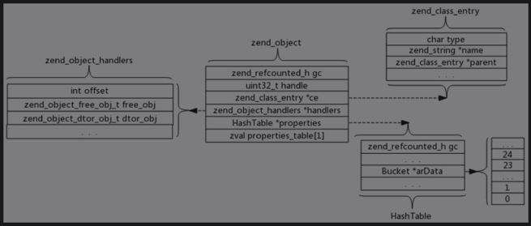

# 对象的实现

```
struct _zend_object {
	zend_refcounted_h gc;
	uint32_t          handle; // TODO: may be removed ???
	zend_class_entry *ce;
	const zend_object_handlers *handlers;
	HashTable        *properties;
	zval              properties_table[1];
};
```
- gc:gc头部。
- handle：每生成一个结构体zend_object，会将其首地址存储在全局变量executor_globals.objects_store.object_buckets中，而handle即为此结构体在此全局变量中的索引。
- ce：所属的类结构体指针。
- properties:HashTable结构，存储对象的动态普通属性值。




```
struct _zend_object_handlers {
	/* offset of real object header (usually zero) */
	int										offset;
	/* general object functions */
	zend_object_free_obj_t					free_obj;
	zend_object_dtor_obj_t					dtor_obj;
	zend_object_clone_obj_t					clone_obj;
	/* individual object functions */
	zend_object_read_property_t				read_property;
	zend_object_write_property_t			write_property;
	zend_object_read_dimension_t			read_dimension;
	zend_object_write_dimension_t			write_dimension;
	zend_object_get_property_ptr_ptr_t		get_property_ptr_ptr;
	zend_object_get_t						get;
	zend_object_set_t						set;
	zend_object_has_property_t				has_property;
	zend_object_unset_property_t			unset_property;
	zend_object_has_dimension_t				has_dimension;
	zend_object_unset_dimension_t			unset_dimension;
	zend_object_get_properties_t			get_properties;
	zend_object_get_method_t				get_method;
	zend_object_call_method_t				call_method;
	zend_object_get_constructor_t			get_constructor;
	zend_object_get_class_name_t			get_class_name;
	zend_object_compare_t					compare_objects;
	zend_object_cast_t						cast_object;
	zend_object_count_elements_t			count_elements;
	zend_object_get_debug_info_t			get_debug_info;
	zend_object_get_closure_t				get_closure;
	zend_object_get_gc_t					get_gc;
	zend_object_do_operation_t				do_operation;
	zend_object_compare_zvals_t				compare;
};
```

## 普通属性
普通属性也存储在对象中。当查找对象的普通属性时，在其所属的类的变量properties_info中，根据属性名key，找到value（类型为zend_property_info结构体），判断属性后，结构体的字段offset即为要查找到的属性值在对象的properties_table中的地址偏移量。