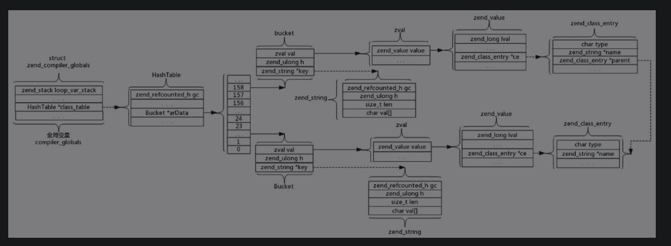
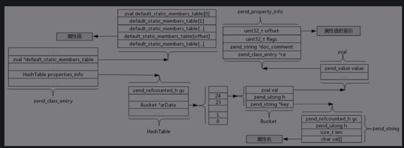

# 类的实现

## 类的结构
```
struct _zend_class_entry {
	char type;
	zend_string *name;
	struct _zend_class_entry *parent;
	int refcount;
	uint32_t ce_flags;

	int default_properties_count;
	int default_static_members_count;
	zval *default_properties_table;
	zval *default_static_members_table;
	zval *static_members_table;
	HashTable function_table;
	HashTable properties_info;
	HashTable constants_table;

	union _zend_function *constructor;
	union _zend_function *destructor;
	union _zend_function *clone;
	union _zend_function *__get;
	union _zend_function *__set;
	union _zend_function *__unset;
	union _zend_function *__isset;
	union _zend_function *__call;
	union _zend_function *__callstatic;
	union _zend_function *__tostring;
	union _zend_function *__debugInfo;
	union _zend_function *serialize_func;
	union _zend_function *unserialize_func;

	zend_class_iterator_funcs iterator_funcs;

	/* handlers */
	zend_object* (*create_object)(zend_class_entry *class_type);
	zend_object_iterator *(*get_iterator)(zend_class_entry *ce, zval *object, int by_ref);
	int (*interface_gets_implemented)(zend_class_entry *iface, zend_class_entry *class_type); /* a class implements this interface */
	union _zend_function *(*get_static_method)(zend_class_entry *ce, zend_string* method);

	/* serializer callbacks */
	int (*serialize)(zval *object, unsigned char **buffer, size_t *buf_len, zend_serialize_data *data);
	int (*unserialize)(zval *object, zend_class_entry *ce, const unsigned char *buf, size_t buf_len, zend_unserialize_data *data);

	uint32_t num_interfaces;
	uint32_t num_traits;
	zend_class_entry **interfaces;

	zend_class_entry **traits;
	zend_trait_alias **trait_aliases;
	zend_trait_precedence **trait_precedences;

	union {
		struct {
			zend_string *filename;
			uint32_t line_start;
			uint32_t line_end;
			zend_string *doc_comment;
		} user;
		struct {
			const struct _zend_function_entry *builtin_functions;
			struct _zend_module_entry *module;
		} internal;
	} info;
};
```
- type：类的类型，共有两种——1代表内置的类，2代表用户自定义的类。
- name：类名。
- parent：继承的父类指针。
- refcount：引用计数。
- ce_flags：位组合标记。其中0x10表示此类有抽象方法，0x20表示此类为抽象类，0x40表示接口，0x80表示特性，0x100表示匿名类，0x400表示其为某个类的子类。

        #define ZEND_ACC_IMPLICIT_ABSTRACT_CLASS	0x10
        #define ZEND_ACC_EXPLICIT_ABSTRACT_CLASS	0x20
        #define ZEND_ACC_INTERFACE		            0x40
        #define ZEND_ACC_TRAIT						0x80
        #define ZEND_ACC_ANON_CLASS                 0x100
        #define ZEND_ACC_ANON_BOUND                 0x200
        #define ZEND_ACC_INHERITED                  0x400
        
- default_properties_count：默认普通属性个数。
- default_static_members_count：默认静态属性个数。
- default_properties_table：默认普通属性值数组。
- default_static_members_table：默认静态属性值数组。
- static_members_table：静态属性成员。
- constructor：构造方法。
- destructor：析构方法。
- clone：克隆方法。
- `__get`：魔术方法`__get`。
- `__set`：魔术方法`__set`。
- `__unset`：魔术方法`__unset`。
- `__isset`：魔术方法`__isset`。
- `__call`：魔术方法`__call`。
- `__callstatic`：魔术方法`__callstatic`。
- `__tostring`：魔术方法`__tostring`。
- `__debugInfo`：魔术方法`__debugInfo`。
- serialize_func：对象序列化方法。
- unserialize_func：对象反序列化方法。
- iterator_funcs:PHP 5开始，支持接口并且内置了Iterator接口，其为此接口的相关操作方法。
- create_object：实例化对象时调用的方法，默认为函数zend_objects_new，可以通过扩展或修改源码来改变此值。
- serialize：序列化方法回调指针。
- unserialize：反序列化方法回调指针。
- num_interfaces：类implements的接口个数。
- interfaces：类implements的接口指针。
- traits：类use的traits指针。
- trait_aliases：类use的特性方法的别名。
- trait_precedences：类use的特性方法的优先级（用于多个特性有相同名称的方法时，解决冲突）。
- info：记录类的其他信息，比如类所在的文件、注释之类。

PHP的类在编译（通过函数zend_compile_class_decl()）时生成。每个类对应着一个结构体struct _zend_class_entry，存储在一个以类名字（全部转为小写）为key的HashTable中，也就是全局变量EG(class_table)中。

```
typedef struct _zend_property_info {
	uint32_t offset; /* property offset for object properties or
	                      property index for static properties */
	uint32_t flags;
	zend_string *name;
	zend_string *doc_comment;
	zend_class_entry *ce;
} zend_property_info;
```
存储属性和方法的相关数据结构。
- offset：当查找普通属性时，此值为地址偏移量；查找静态属性时，此值为索引。

        一个结构体中只能有一个柔性数组，而对象结构中，只有这一个字段properties_table是变长的数组，所以把此字段放在结构体最后面，用柔性数组即可。
        而类结构中，有三个字段（default_properties_table、default_static_members_table、static_members_table）是变长数组，所以只能通过指针的方式实现。
- flags：属性的访问权限以及是否是静态属性。
        
        #define ZEND_ACC_PUBLIC		0x100
        #define ZEND_ACC_PROTECTED	0x200
        #define ZEND_ACC_PRIVATE	0x400
        #define ZEND_ACC_STATIC			0x01
        #define ZEND_ACC_ABSTRACT		0x02
        #define ZEND_ACC_FINAL			0x04
        #define ZEND_ACC_IMPLEMENTED_ABSTRACT		0x08
- name：属性名称。
- doc_comment：注释。
- ce：所属的类指针。



## 静态属性、常量和方法

### 静态属性
- 静态属性存储在properties_info和default_static_members_table中。
- properties_info是一个HashTable，当访问一个静态属性时，以变量名为key，在properties_info中找到对应的value，再取结构体struct _zend_property_info中的字段offset。
- default_static_members_table是一个数组，所以default_static_members_table[offset]即为目标属性值。



### 常量
类常量存储在HashTable类型的constants_table字段中。

### 方法
- 类的方法（包括类的静态方法和类的普通方法）和普通方法（非成员方法）编译后生成的zend_op_array基本没有区别。
- 类成员方法的访问权限（private、protected、public）以及是否是静态方法等信息，存储在zend_op_array中的fn_flags字段里。

## 接口和特性

### 接口
关联一个类与其所实现的接口，是通过函数zend_do_implement_interface()来实现的。
- ce->num_interfaces加1，将此接口的结构体指针赋值给ce->interfaces[ce->num_interfaces-1]。
- 遍历接口中的constants_table，并依次插入到ce->constants_table。如果类和接口有相同名字的常量，则报错。
- 遍历接口中的function_table，根据继承的逻辑，判断是否可以插入到类的function_table中。如果可以，则继承此方法。否则不进行任何操作。
- 将接口中的interfaces按顺序拷贝到类的interfaces后。

## 特性
特性与类进行关联通过方法zend_do_bind_traits()来实现。
- 完成类结构体指针ce的特性初始化。遍历ce的特性优先级变量ce->trait_precedences（假如遍历中的当前变量叫作cur_pre）。
- 将特性的方法拷贝到类中。遍历类结构体中的变量ce->traits，将其方法拷贝到ce->function_table。在拷贝之前执行判断：先将ce->trait_precedences中因为优先级被排除的类的方法排除掉，如果有方法存在别名，则将以别名为新名的方法拷贝到ce->function_table。
- 校验别名的相关语法。遍历类结构体中的特性别名变量ce->trait_aliases，如发现仍然有别名所属的类未找到，则抛出语法错误。
- 拷贝特性的属性到类中。遍历ce->num_traits，即遍历每个特性的属性properties_info，如果此属性在类中存在，且是继承于父类，则将此属性删除，然后将特性中的属性拷贝到类中；若不是继承自父类，则继续遍历。如果此属性在类中不存在，则将特性中的属性拷贝到类中。
- 校验类是否已实现所有抽象方法，没有则报错。
- 校验类是否存在与类同名的方法来做构造方法，有则提示。

## 继承

### 继承属性
普通属性和静态属性的继承是先后完成的。

#### 普通属性
- 申请一个元素类型是zval的数组table，大小为父类的普通属性个数（parent_ce->default_properties_count）和子类的普通属性个数（ce->default_properties_count）之和。
- 将父类的普通属性中parent_ce->default_properties_table的元素拷贝到数组table。
- 将子类的普通属性中的ce->default_properties_table的ce->default_properties_count个元素拷贝到table+parent_ce->default_properties_count。
- 释放子类的普通属性指针ce->default_properties_table，将table赋值给ce->default_properties_table。

#### 通用属性合并方法
- 遍历properties_info：如果元素是静态属性，则对offset加parent_ce->default_static_members_count。
- 如果元素是普通属性，则对offset加parent_ce->default_properties_count *sizeof(val)。
- 接下来进行子类的properties_info和父类的properties_info的合并。

### 继承常量
常量存储是用HashTable实现的，两个HashTable的合并比较简单，无非就是遍历父类的constants_table。
- 如果子类中存在此常量，则不进行任何操作。
- 如果子类中不存在此常量，则把此key->val键值对插入到子类的constants_table中。

### 继承方法
与常量继承的实现类似，方法的继承也是遍历父类的function_table，然后将结果插入到子类的function_table中。不同的是，可能存在方法为private、abstract或final特性，或者同一个方法在父类中为静态方法，而在子类中为普通方法等特殊情况。