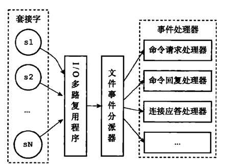

# 文件事件

## 定义
redis通过套接字与客户端「或其他redis服务器」进行连接，文件事件是对套接字的抽象。服务器与客户端的的通信会产生相应的文件事件，服务器通过监听并处理这些事件来完成一系列网络通信操作。

## 文件事件处理器

多个事件处理器分别用于实现不同的网络通信需求。
- 连接应答处理器

        当redis初始化时，程序会将处理器与服务器监听套接字的AE_READABLE事件关联起来。
- 命令请求处理器

        当客户端通过连接应答处理器连接到服务器后，服务器会将客户端的套接字和命令请求处理器关联起来，当客户端发送请求时，套接字产生AE_READABLE事件，引发命令请求处理器执行，并执行相关套接字的读入操作。
        
- 命令回复处理器

        当服务器有命令回复需要传送给客户端时，服务器会将客户端的AE_WRITEABLE事件与命令回复处理器关联起来，当客户端准备好接收时，产生AE_WRITEABLE事件，引发命令回复处理器执行，并执行相应的套接字写入操作。命令回复发送完毕后，服务器断开回复处理器和套接字AE_WRITEABLE事件的关联
        
- 复制处理器

        主从

## 事件的类型
1. 当有套接字可读时，或者有新的可应答套接字出现时，套接字产生AE_READABLE事件。
2. 当套接字变得可写时，套接字产生AE_WRITEABLE事件。
3. 如果一个套接字可读又可写时，先读后写。
