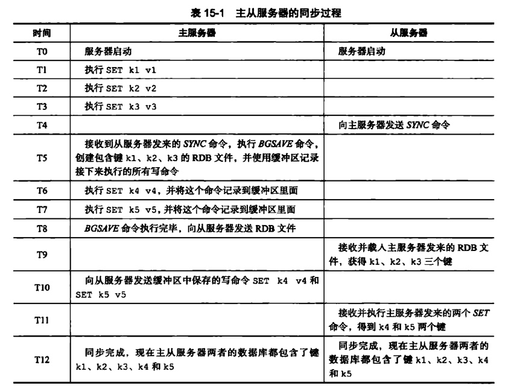
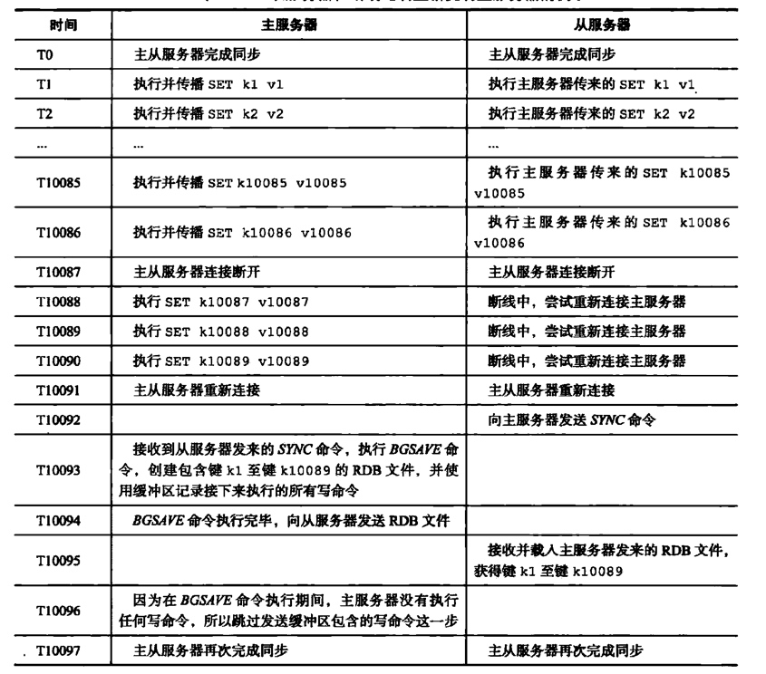
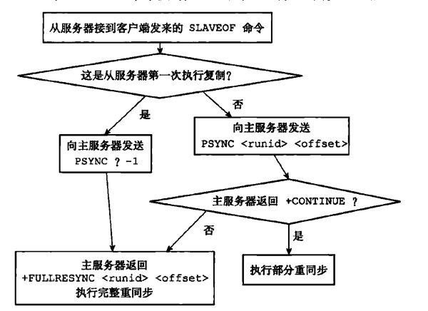

# 复制
- 命令：slaveof ip prot
- 选项：slaveof
- 复制其他服务器的数据

## 旧版复制
复制功能分为同步和命令传播两个操作。

### 同步【sync】
将从服务器的数据库状态更新为主服务器的状态。

#### 步骤
1. 从服务器向主服务器发送sync命令。
2. 主服务收到命令后执行BGSAVE，在后台生成rbd文件，并使用一个缓冲区记录从现在开始执行的所有写命令。
3. BGSAVE命令执行完成后，发送给从服务器，从服务器载入rbd文件，更新数据。
4. 主服务将缓冲区内容的命令发送给从服务器。

#### 图解

### 命令传播【command propagete】
主服务器发生变更时，修改从服务器，保持一致性。

#### 步骤
主服务器将自己执行的写命令发送给从服务器。

### 缺陷
初次复制没有问题，断线后复制有问题，效率很低。
需要重新同步。

#### 图解断线后重连

## 新版复制
使用psync代替sync命令，具有完整重同步和部分重同步两种模式。
- 完整重同步和初次复制一样。
- 部分重同步属于断线后重连，如果条件允许，主服务器只发送断开期间执行的写命令

### 部分重同步
#### 复制偏移量
主从服务器分别维护一个复制偏移量。
- 主服务器每次向从服务器传播N个字节的数据时，自身维护的偏移量+N
- 从服务器每接收到主服务传播的N个字节数据，偏移量+N。
- 重连时，从服务器向主服务器报告偏移量。

#### 复制积压缓冲区
1. 主服务器维护的一个固定长度「默认1MB」的先进先出队列。
2. 主服务器进行命令传播时，不仅把命令发给从服务器，并且将写命令入队复制积压缓冲区。
3. 队列为每个字节记录相应的复制偏移量。
4. 主服务根据偏移量觉得执行何种psync操作。
    1. 如果偏移量在队列中，执行部分重同步。
    2. 如果不在队列，执行完整重同步。

#### 服务运行ID
1. 运行id服务器启动时自动生成，40个随机的16进制。
2. 当服务器初次复制时，主服务将自己的运行ID发送给从服务器，从服务器保存。
3. 断线重连，从服务器发送保存的运行ID。
4. 主服务器判断运行ID是否和自己一致。
    1. 一致：跟进复制积压缓冲区进行部分重同步。
    2. 不一致：执行完整重同步。

## PSYNC实现

- fullresync
    - run_id：主服务器的run_id；
    - offiset：主服务器当前的偏移量，从服务器需要作为自己的初始偏移量。

## 复制的实现
1. 设置主服务器的地址和端口

        - slaveof ip prot
        - slaveof是个异步命令
2. 建立套接字连接

        1. 从服务器创建向主服务器的套接字连接，如果能成功连接，从服务器将为这个套接字关联一个专门用于处理复制工作的文件处理器。负责执行后续的复制工作，接收rdb文件，接收写命令。
        2. 主服务器接收到套接字连接后，创建相应的客户端连接。
3. 发送ping命令
    从服务器成为主服务器的客户端之后，首先向主服务器发送ping命令。
    - ping的作用

            1. ping命令检查套接字的读写是否正常。
            2. 检查主服务器能否正常处理命令请求。
    - ping的返回

            1. 主服务器发送了回复，从服务器不能在规定时间内读取回复，说明网络不佳，从服务器断开并重新创建套接字。
            2. 主服务返回错误，表示主服务器暂时不能处理从服务器的命令。从服务器断开并重新创建套接字。
            3. 返回pong，从服务器继续执行复制的下个步骤。
1. 身份验证
    - 如果从服务器设置了masterauth选项，进行身份验证。向主服务器发送auth命令，参数为masterauth选项的值。
    - 如果从服务器没有设置masterauth选项，不进行身份验证。
    - auth的返回值：
        - 如果主服务器没有设置requirepass选项，返回no password is set，终止复制，重建套接字。
        - 如果主服务器设置requirepass选项，没有通过，返回invaild password错误，终止复制，重建套接字。
        - 通过验证，继续复制。
2. 发送端口信息

        1. 从服务器发送replconf listening-port <port>。表示从服务器的监听端口。
        2. 主服务器将端口号记录在客户端的slave_listening_port属性中。
3. 同步

        1. 从服务器向主服务器发送psync命令，执行同步操作。
        2. 在执行同步后，主服务也变成了从服务器的客户端。主服务需要发送缓冲区写命令或复制缓冲区的写命令。
4. 命令传播

        主服务器一直将执行的写命令发送给从服务器。
        
## 心跳监测
命令传播阶段，从服务器以默认每秒一次的频率，向主服务器发送replconf asc <replication_offset>命令。
1. 检测主从服务器的连接状态。
2. 辅助实现min-slaves配置选项。
3. 检测命令丢失。

### 检测主从服务器的连接状态
- info replication命令，查看从服务器最后一次ack到现在的秒数
- lag值超过1s，说明主从连接出了问题。

### 辅助实现min-slaves配置选项
min-slaves-to-write 3
min-slaves-max-lag 10

表示如果从服务器数量超过3个，并且每个lag值都超过10s。主服务器拒绝写命令。

### 检测命令丢失
如果命令丢失，主服务器从复制积压缓冲区找到丢失的请求，重新发送。