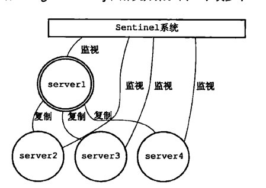
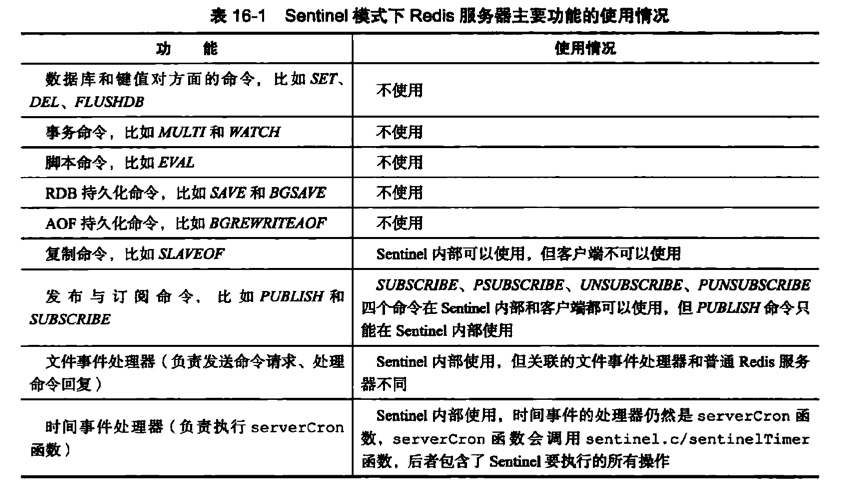
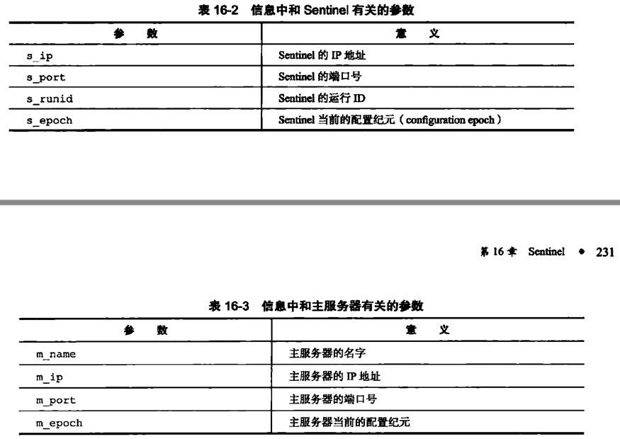
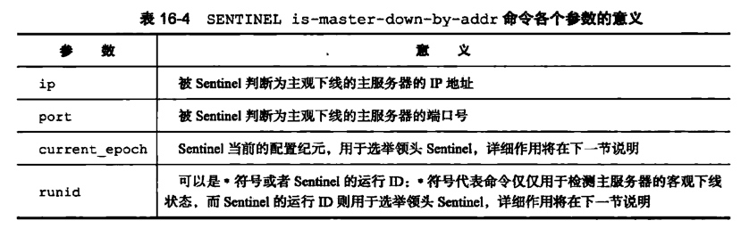

# 哨兵「sentinel」
高可用性的解决方案：由1个或多个sentinel实例组成的sentinel系统可以监视任意多个主服务器，以及这些主服务下的所有从服务器，并在监视的主服务器处于下线状态时，自动将属下的某个从服务器升级为主服务器。

当server1的下线时长超过用户设定的下线时长上限时，sentinel就会对server1进行故障转移操作。

## 故障转移
1. sentinel挑选server1属下的一个从服务器，将选中的从服务器升级为主服务器。
    1. 挑选一个状态良好，数据完整的从服务器，向服务器发送slaveof no one命令，将这个服务换为主服务器。
    2. 发送slaveof no one命令后，每秒一次向被升级的服务器发送info命令，当角色变为mster后，标识已经升级成功。
2. sentinel向所有的从服务器发送新的复制指令，让他们成为新的主服务器的从服务器，当所有从服务器都开始复制新的主服务器时，故障转移操作完毕。
    1. 向其他从服务器发送新的slaveof命令。
3. sentinel继续监视server1服务器，在其上线后，设置为新的主服务器的从服务器。
    1. 修改结构体的结构。


## 启动并初始化哨兵

### 命令
- redis-sentinel sentinel.conf
- redis-server sentinel.conf --sentinel

### 执行步骤
1. 初始化服务器。
2. 将普通服务器使用的代码替换为sentinel专用代码。
3. 初始化sentinel状态。
4. 根据给定的配置文件，初始化sentinel监听的服务器列表。
5. 创建连向主服务器的网络连接。

### 初始化服务器
初始化一个普通的redis服务器。

### 使用sentinel专用代码
用以限制命令，修改端口。


### 初始化sentinel状态
初始化一个sentinelState的数据结构

```
struct sentinelState {
    // 当前纪元，用于实现故障转移。
    unit64_t current_epoch;
    // 保存了所有监视的主服务器
    // key是主服务器的名称，值是一个指向sentinelRedisInstance对象的指针。
    dict *masters;
    // 是否进入了TILT模式
    int tilt;
    // 目前正在执行的脚本数量
    int runing_scripts;
    // 进入TILT模式的时间
    mstime_t tilt_start_time;
    // 最后一次执行时间处理器的时间
    mstime_t previous_time;
    // 一个fifo队列包含所有需要执行的用户脚本
    list *scripts_queue;
}
```
### 初始化sentinel状态的master属性
```
struct sentinelRedisInstance {
    // 标识值，记录实例的类型和实例的当前状态
    int flags;
    // 实例的名称，从服务器格式为ip:port，主服务name为配置文件中设置
    char *name;
    // 实例的运行id
    char *run_id;
    // 配置纪元，用于实现故障转移。
    unit64_t current_epoch;
    // 实例地址
    sentinelAddr *addr;
    // 实例无响应多少毫秒后才会判断主观下线。由sentinel down-after-milliseconds控制
    mstime_t down_after_period;
    // 判断这个实例客观下线所需的支持投票数，由monitor <master-name> <IP> <port> <quorum> 的quorum参数控制
    int quorum;
    // 在执行故障转移操作时，可以同时对新的主服务进行同步的从服务器数量, sentinel paraller_syncs <master-name> <number>
    int paraller_syncs;
    // 刷新故障转移状态的最大时限,sentinel failover_time <master-name> <ms>
    mstime_t failover_time;
    // 从服务器节点
    dict *slaves;
    // 其他sentinelRedisInstance节点
    dict *sentinels
}

struct sentinelAddr {
    char *ip;
    int port;
}
```

### 创建连向主服务器的网络连接
创建两个连向主服务器的异步网络连接
- 命令连接：专门用于向主服务发送命令，并接收回复。
- 订阅连接：订阅主服务器的_sentinel_:hello频道。

## 获取主服务器信息
以10秒一次的频率，向主服务器发送info命令获取主服务器的信息。
1. 获取主服务器的run_id，和flags角色。
2. 获取主服务属下的所有从服务器slaves。

### slaves
是一个字典，key时ip:port，value是sentinelRedisInstance结构体的一个指针。
1. 如果从服务器节点存在，对结构体进行更新。
2. 如果从服务器节点不存在，创建结构体。
3. 主服务器的flags属性值为SRI_MASTER，从服务器的flags属性值为SRI_SLAVE。

## 获取从服务器信息
1. 获取到从服务器后，为从服务器创建命令连接和订阅连接。
2. 每10秒1次通过info命令获取从服务信息
    1. run_id：从服务器的运行ID
    2. role：从服务器的角色
    3. 主服务器的ip和端口：master_host和master_port；
    4. master_link_status：主从服务器的连接状态
    5. slave_priority：从服务器的优先级
    6. slave_repl_offset：从服务器的复制偏移量。

## 向主服务器和从服务器发送信息
每两秒一次发送命令  PUBLISH \_sentinel_ :hello "\<s_ip>,\<s_port>,\<s_runid>,\<s_epoch>,\<m_name>,\<m_ip>,\<m_port>,\<m_epoch>"


## 接收来自主服务器和从服务器的频道信息
- 和服务器建立连接之后，向服务器发送命令「SUBSCRIBE \_sentinel_ :hello」，订阅持续到和服务器断开连接为止。
- 这个订阅可以接收其他sentinel发布的信息。可以通过其他sentinel的信息更新主服务器实例结构。

### 更新sentinel字典
更新该服务器实例的sentinels属性，存储其他哨兵的信息。

### 创建连向其他哨兵的命令连接
使用命令连接相连的各个哨兵可以通过向其他哨兵发送命令来进行信息交换

## 检查主观下线状态
每秒向服务器发送ping命令，并通过返回值判断是否在线。
如果持续不在线超过down_after_period毫秒后，将master标记为主观下线，主服务器的flags属性中打开STR_S_DOWN标识。

## 检查客观下线状态
- 向其他哨兵发送命令
判断主观下线之后，向其他哨兵发送命令「sentinel is-master-down-by-addr \<ip> \<port> \<current_epoch> \<run_id>」询问是否同意主服务器下线。


- 接收sentinel命令，将返回3个结果
    - down_state：对主服务器的检查结果
        - 1主服务器已下线，
        - 2主服务器未下线。
    - leader_runid：
        - *代表仅仅用于检测服务器的下线状态，
        - sentinel_id则用于选举领头sentinel。
    - leader_epoch：局部领头sentinel的配置纪元。
- 接收sentinel命令回复
    - 统计同意主服务下线的sentinel数量，超过上线后，将主服务器flags属性的SRI_O_DOWN标识打开。

## 选举领头sentinel
1. 所有监视服务器的在线sentinel都有被选举为领头sentinel的资格。
2. 每次选举之后，无论成功与否，所有sentinel的配置纪元都自增一次。
3. 在一个配置纪元里，所有sentinel都有一次将某个sentinel设置为局部头领的资格，并且局部头领一但设置，在这个配置纪元里就不能再更改。
4. 每个发现主服务进入客观下线的sentinel都会要求其他sentinel将自己设置为局部头领。
5. runid参数不是*时，表示源要求其他sentinel将自己设置为后者的局部头领。
6. 设置局部头领先到先得，其他的要求设置局部头领的要求会被拒绝。
7. 目标sentinel接收到sentinel命令后，回复记录了目标局部头领的sentinel的运行id和配置纪元。
8. 接收到sentinel回复之后，检查回复的配置纪元和自己的是否相同，相同判断运行id和自己的是否一致，一致表明目标sentinel将自己设置为了局部头领。
9. 被半数以上的sentinel设置为局部领头，则被设置的sentinel成为领头sentinel
10. 一个配置纪元中只能设置一次局部领头。
11. 如果在给定时限内没有选举出领头，会隔一段时间再选举，直到选出为止。


