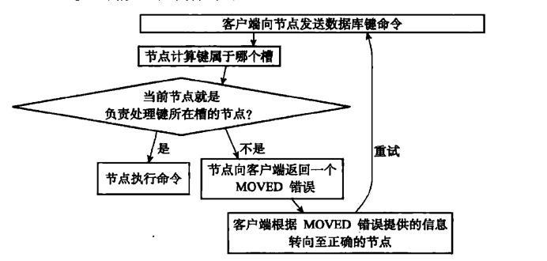

# 在集群中执行命令


## 计算键属于哪个槽
```
def solt_number(key):
    return CRE16(key) & 16383
```
使用 cluster keyslot \<key> 命令查看槽位。

## 判断槽是否由当前节点负责处理
判断clusterState.slots[i] 是否等于 clusterState.myself

## moved错误
格式：moved \<slot> \<ip>:\<port>  
- 集群客户端通常会与集群中的多个节点创建套接字连接，所谓节点转向实际上就是换一个套接字发送命令。
- 集群模式下的cli并不会打印出moved错误。

## 节点数据库的实现
- 用跳跃表 clusterState.slot_to_keys老保存键和槽的关系，score是槽，value是键值
- 保存和删除键时需要操作这个跳表
- 用命令cluster getkeysinslot \<slot> \<count> 来返回最多count个slot槽的键