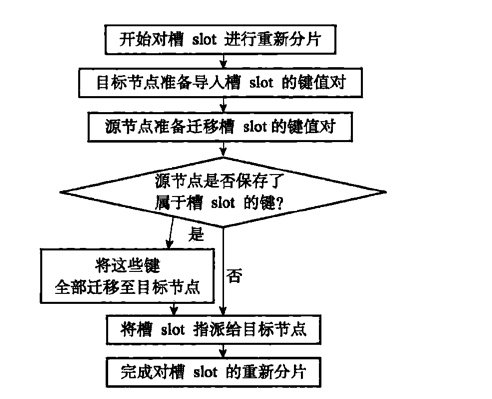
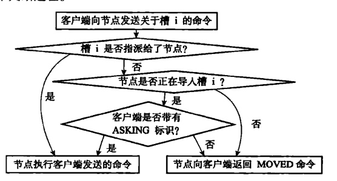

# 分片

## 重新分片实现原理
redis可以在线重新分片，redis-trib负责执行

1. redis-trib对目标节点发送 「cluster setslot \<slot> importing \<source_id>」命令，让目标节点准备好从源节点导入slot槽的键值对。
2. redis-trib对源节点发送「cluster setslot \<slot> migrate \<target_id>」命令，让源节点准备好将属于槽slot的键值对迁移至目标节点。
3. redis-trib向源节点发送「cluster getkeysinslot \<slot> \<count> 」命令，获取最多count个属于槽slot的键值对的键名。
4. 对每个键名，redis-trib向源节点发送「migrate \<target_ip> \<target_post> \<key_name> 0 \<timeout>」命令，将键迁移至目标节点。
5. 重复执行步骤3和步骤4，知道没有键为止。
6. redis-trib向集群中任意一个节点发送「cluster setslot \<slot> NODE \<target_id>」命令，将槽slot指派给目标节点，这一指派信息会通过消息发送至整个集群，最终所有的节点都会知道槽slot已经指派给了目标节点。

## ASK错误

ask错误也不打印，而是被自动转发

1. 格式：ask \<slot> \<ip>:\<port>
2. 如果没有在自己的数据库中找到key，如果目标节点正在向其他节点导入槽，返回ask错误。
3. 客户端接收到ask错误后转向目标节点。
4. 发送asking命名。
5. 再次发送执行命令。

### cluster setslot importing命令的实现
如果clusterState.importing_lsots_from.[i]指向的不为null，表示节点正在从clusterNode所代表的节点导入槽。

### cluster setslot migrate命令的实现
如果clusterState.importing_lsots_from.[i]指向的不为null，表示节点正在将槽导入clusterNode所代表的节点。

### ASKING的实现

1. 打开客户端的REDIS_ASKING标识
2. 标识打开后，redis会破例执行关于这个槽的命令一次。
3. 执行结束后，关闭REDIS_ASKING标识。

## ask错误和moved错误的区别
1. moved表示时这个槽的负责权已经转到了另一个节点。
2. ask是槽转移过程中的一种补救措施。