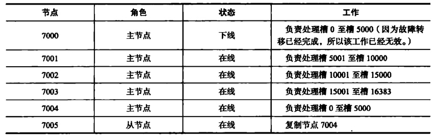

# 复制与故障转移
1. 转移前：

2. 转移后：

3. 如果主节点再次上线，主节点会变成从节点的从节点。

## 设置从节点
1. 向一个节点发送命令：cluster replacete \<node_id>
2. 接收到这个命令的节点会首先在自己的clusterNode.nodes字典中找到node_id对应的节点的clusterNode结构，并将自己的clusterState.myself.sloveof指向这个节点。
3. 然后修改自己节点的clusterState.myself.flags属性，打开REDIS_NODE_SLAVE标识。
4. 调用复制代码，根据主节点的ip和端口号开始主从复制。
5. 复制过程中，给其他节点发送消息，其他节点都会知道这个节点正在复制。
6. 集群中的每个节点都会在代表这个主节点的结构中记录复制信息。slaves和numslaves。

## 故障检测
- 集群中每个节点都会定期的向其他节点发送ping消息，来检测对方是否在线，如果没有在规定时间内收到pong回复，会标记疑似下线。
- 各个节点会用互相发送消息的方式交换自己对各个节点的检测。检测结果放在被标记疑似下线的fail_reports链表中。
- 如果半数以上负责处理槽的节点都认为这个节点疑似下线，会将这个节点标记未已下线FAIL，然后通知其他节点，其他节点也会把这个节点标记为已下线。

```
struct clusterNodeFailReport {
    // 报告目标节点已经下线的节点
    struct clusterNode *node;
    // 最后一次收到下线报告的时间
    mstime_t time;
}
```

## 故障转移
1. 复制下线主节点的所有从节点中，会有一个节点被选中。
2. 被选中的节点执行slave no noe命令，成为新的主节点。
3. 新的主节点会撤销所有对已下线节点的槽指派，并将槽全部指向自己。
4. 向集群广播pong消息，其他节点也讲槽指派导新的主节点。
5. 新的主节点开始处理命令，故障转移结束。

### 选举新的主节点
同选举sentinel领头的方式一样。

